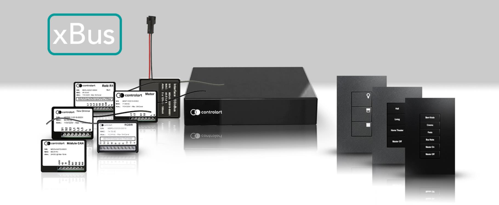
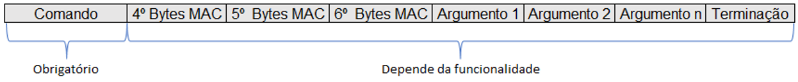
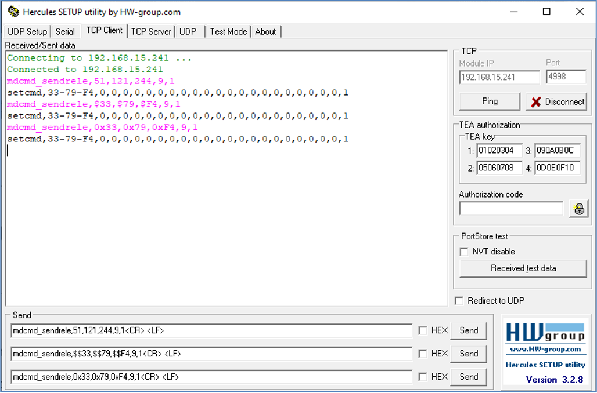
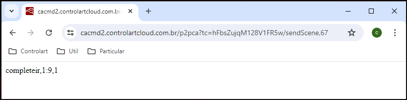
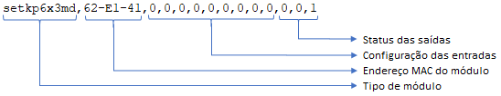
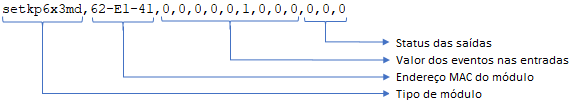
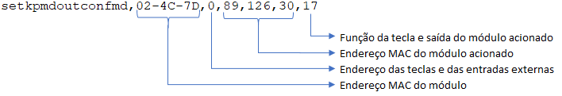
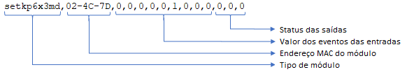
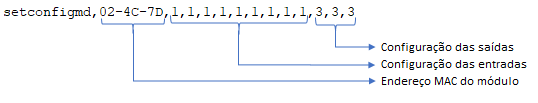

> **CONTROLADORA** **XPORT** **PRO** **&** **XBUS** API
>
>  style="width:1.59931in;height:0.30417in" />**XPORT** **PRO** **&**
> **PRO+** **&** **XBUS**
>
> Para mais informações sobre produtos e serviços, viste o nosso site:
> [<u>www.controlart.com.br</u>](http://www.controlart.com.br/) Para
> informações comerciais enviar e-mail para:
> [<u>comercial@controlart.com.br</u>](mailto:fabio@controlart.com.br)
>
> **MARCAS** **REGISTRADAS**
>
> Controlart e o logotipo Controlart são marcas comerciais ou marcas
> registradas da Controlart no Brasil.
>
> Todos os outros nomes de empresas ou produtos aqui mencionados são
> marcas comerciais ou marcas registradas de suas respectivas empresas.
>
> Todos os direitos reservados. Esta publicação não pode ser
> reproduzida, no todo ou em parte, sem permissão prévia expressa por
> escrito da Controlart.
>
> API 1
>
>  style="width:1.59931in;height:0.30417in" />**XPORT** **PRO** **&**
> **PRO+** **&** **XBUS**
>
> **HISTÓRICO** **DE** **REVISÕES**

||
||
||
||

> API 2
>
>  style="width:1.59931in;height:0.30417in" />**XPORT** **PRO** **&**
> **PRO+** **&** **XBUS**
>
> **ÍNDICE**

**1** **PROPÓSITO** **DESTE**
**DOCUMENTO...................................................................................5**
**1.1**
**OBJETIVO.....................................................................................................................................**
**5**

> **1.2** **DEFINIÇÕES**
> **.................................................................................................................................**
> **5** 1.2.1 DEFINIÇÕES E ABREVIATURAS
> ............................................................................................................................5
>
> **2** **COMANDOS** **PARA** **XPORT** **PRO,** **PRO+** **&**
> **XBUS............................................................6**
> **2.1** **INTRODUÇÃO**
> **..............................................................................................................................**
> **6** **2.2** **PRÉ**
> **REQUISITOS...........................................................................................................................**
> **7** **2.3** **ESTRUTURA** **DOS** **COMANDOS**
> **......................................................................................................**
> **9** **2.4** **COMANDO** **EM** **TCP/IP** **CLIENTE**
> **TERMINAL..................................................................................**
> **10**
>
> **2.5** **COMANDOS** **PARA** **XPORT** **PRO** **OU** **PRO+.**
> **...................................................................................**
> **11** 2.5.1 LIGAR TODAS AS SAÍDAS, DE TODOS O
> MÓDULOS...........................................................................................11
> 2.5.2 DESLIGAR TODAS AS SAÍDAS, DE TODOS O
> MÓDULOS.....................................................................................11
> 2.5.3 RESETAR A XPORT
> PRO......................................................................................................................................12
> 2.5.4 VERIFICAR STATUS DE
> REDE..............................................................................................................................12
> 2.5.5 VERIFICAR LISTA DE
> MÓDULOS.........................................................................................................................13
> 2.5.6 VERIFICAR STATUS DOS
> MÓDULOS...................................................................................................................13
> 2.5.7 VERIFICAR FEEDBACK DA
> HORA........................................................................................................................14
> 2.5.8 REQUISITAR ÚLTIMO STATUS DE ENTRADA E SAÍDA DO MÓDULOS.
> ................................................................14
> 2.5.9 VERIFICAR STATUS FÍSICO ATUAL DE UM
> MÓDULO..........................................................................................15
> 2.5.10 COMANDOS PARA PORTA SERIAL
> RS232......................................................................................................16
> 2.5.11 COMANDOS PARA PORTA SERIAL
> RS485......................................................................................................18
> 2.5.12 ENVIA COMANDO
> IR.....................................................................................................................................20
> 2.5.13 ENVIAR COMANDOS DE RF EM
> 433.92MHZ.................................................................................................21
> 2.5.14 ENVIAR COMANDOS DE RF EM 433.92MHZ EM SISTEMAS
> RTS...................................................................22
> 2.5.15 ENVIAR COMANDOS VIA
> BROWSER.............................................................................................................23
>
> **2.6** **COMANDOS** **PARA** **MODULO** **XBUS** **RELÊ.**
> **....................................................................................**
> **24** 2.6.1 LIGAR OU DESLIGAR MULTIPLAS SAÍDAS DO MÓDULO XBUS
> RELÉ..................................................................24
> 2.6.2 INVERTER MULTIPLAS SAÍDAS DO MÓDULOS XBUS RELÉ -
> TOGGLE.................................................................25
>
> **2.7** **COMANDOS** **PARA** **MÓDULO** **XBUS**
> **DIMMER...............................................................................**
> **26** 2.7.1 LIGAR OU DESLIGAR MULTIPLAS SAÍDAS DO MÓDULO XBUS DIMMER.
> ..........................................................26 2.7.2
> INVERTER MULTIPLAS SAÍDAS DO MÓDULOS XBUS DIMMER -
> TOGGLE..........................................................27
>
> **2.8** **COMANDOS** **PARA** **MÓDULO** **XBUS** **RGBW.**
> **..................................................................................**
> **28** 2.8.1 LIGAR OU DESLIGAR MULTIPLAS SAÍDAS DO MÓDULO XBUS
> RGBW................................................................28
> 2.8.2 INVERTER MULTIPLAS SAÍDAS DO MÓDULOS XBUS RGBW -
> TOGGLE..............................................................29
> 2.8.3 LIGAR OU DESLIGAR AS SAIDAS RGBW DO MÓDULO XBUS RGBW
> ..................................................................30
> 2.8.4 LIGAR OU DESLIGAR AS SAIDAS RGB DO MÓDULO XBUS
> RGBW......................................................................31
> 2.8.5 DEFINIR GANHO DO MÓDULO XBUS RGBW.
> ....................................................................................................32
> 2.8.6 CONFIGURAR EFEITOS DO MÓDULO XBUS
> RGBW............................................................................................33
>
> **2.9** **COMANDOS** **PARA** **MÓDULO** **MOTOR**
> **XBUS.................................................................................**
> **34** 2.9.1 INICIAR CALIBRAÇÃO PARA
> CIMA.....................................................................................................................34
> 2.9.2 TERMINAR CALIBRAÇÃO PARA
> CIMA................................................................................................................34
>
> API 3
>
>  style="width:1.59931in;height:0.30417in" />**XPORT** **PRO** **&**
> **PRO+** **&** **XBUS**
>
> 2.9.3 INICIAR CALIBRAÇÃO PARA
> BAIXO....................................................................................................................35
> 2.9.4 TERMINAR CALIBRAÇÃO PARA
> BAIXO...............................................................................................................35
> 2.9.5 ALINHAMENTO (CORTINA FECHADA).
> ..............................................................................................................36
> 2.9.6 INVERTER
> SOBE/DESCE.....................................................................................................................................36
> 2.9.7 ALTERAR MODO,
> CORTINA/VENTILADOR.........................................................................................................37
> 2.9.8 OBTER MODO.
> ..................................................................................................................................................37
> 2.9.9 MOVER O MOTOR PARA UMA POSIÇÃO
> DESEJADA..........................................................................................38
> 2.9.10 MOVER O MOTOR PARA O LADO A
> ..............................................................................................................39
> 2.9.11 MOVER O MOTOR PARA O LADO B
> ..............................................................................................................40
> 2.9.12 PARAR O
> MOTOR..........................................................................................................................................41
> 2.9.13 FORÇAR MOVER O MOTOR PARA O LADO A
> ................................................................................................42
> 2.9.14 FORÇAR MOVER O MOTOR PARA O LADO B
> ................................................................................................43
> 2.9.15 FORÇAR PARAR O
> MOTOR............................................................................................................................44
>
> **2.10** **COMANDOS** **PARA** **KEYPAD** **IVOLV** **XBUS**
> **RELÉ..............................................................................**
> **45**
>
> 2.10.1 2.10.2 2.10.3 2.10.4 2.10.5 2.10.6 2.10.7 2.10.8 2.10.9 2.10.10
> 2.10.11

REQUISITAR ÚLTIMO STATUS DE ENTRADA E SAÍDA DO
MÓDULOS.............................................................45
VERIFICAR CONFIGURAÇÃO DE UM MÓDULO DO KEYPAD IVOLV XBUS RELÉ.
............................................46 LIGAR OU DESLIGAR
MULTIPLAS SAÍDAS DO KEYPAD IVOLV XBUS
RELÉ......................................................47 INVERTER
MULTIPLAS SAÍDAS DO KEYPAD IVOLV XBUS RELÉ - TOGGLE
......................................................48 VERIFICAR VALOR
DO BRILHO DO LED DA
TECLA.........................................................................................49
AJUSTE DE BRILHO DO LED DAS TECLAS UM KEYPAD.
.................................................................................49
AJUSTE DE BRILHO DO LED DAS TECLAS DE TODOS OS
KEYPAD’S................................................................50
VERIFICAR A CONFIGURAÇÃO DAS ENTRADAS DO KEYPAD IVOLV XBUS
RELÉ.............................................51 CONFIGURAR AS
ENTRADAS DO KEYPAD IVOLV XBUS
RELÉ.........................................................................52
FEEDBACK DO KEYPAD AO ACIONAR UM ENTRADA OU
SAÍDA....................................................................53
VERIFICAR A CONFIGURAÇÃO DE TODAS AS ENTRADAS E SAIDAS.
.............................................................54

> **2.11** **COMANDOS** **PARA** **KEYPAD** **IVOLV** **XBUS**
> **DIMMER........................................................................**
> **55**
>
> 2.11.1 2.11.2 2.11.3 2.11.4 2.11.5 2.11.6 2.11.7 2.11.8 2.11.9 2.11.10
> 2.11.11

REQUISITAR ÚLTIMO STATUS DE ENTRADA E SAÍDA DO
MÓDULOS.............................................................55
VERIFICAR CONFIGURAÇÃO DO KEYPAD IVOLV XBUS
DIMMER...................................................................55
LIGAR OU DESLIGAR MULTIPLAS SAÍDAS DO KEYPAD IVOLV XBUS DIMMER.
..............................................56 INVERTER MULTIPLAS
SAÍDAS DO KEYPAD IVOLV XBUS DIMMER -
TOGGLE................................................57 VERIFICAR VALOR
DO BRILHO DO LED DA TECLA DO
KEYPAD......................................................................58
AJUSTE DE BRILHO DO LED DAS TECLAS DE UM KEYPAD.
............................................................................58
AJUSTE DE BRILHO DO LED DAS TECLAS DE TODOS OS
KEYPAD’S................................................................59
VERIFICAR A CONFIGURAÇÃO DAS ENTRADAS DO KEYPAD.
........................................................................60
CONFIGURAR AS ENTRADAS DO KEYPAD IVOLV XBUS DIMMER.
.................................................................61
FEEDBACK DO KEYPAD AO ACIONAR UM ENTRADA OU
SAÍDA....................................................................62
VERIFICAR A CONFIGURAÇÃO DE TODAS AS ENTRADAS E SAIDAS.
.............................................................63

> **2.12** **COMANDOS** **PARA** **XBUS**
> **RF2IR...................................................................................................**
> **64**
>
> **2.13** **COMANDOS** **PARA** **INTERFACE** **XBUS** **RF433.**
> **................................................................................**
> **65**
>
> **3** **SOFTWARE.**
> **.......................................................................................................................66**
>
> API 4
>
>  style="width:1.59931in;height:0.30417in" />**XPORT** **PRO** **&**
> **PRO+** **&** **XBUS**
>
> **1** **PROPÓSITO** **DESTE** **DOCUMENTO**
>
> **1.1** **OBJETIVO**
>
> Este manual contém informações detalhadas sobre os comandos da xPort
> Pro, os quais permitem enviar comandos e receber feedbacks para
> controlar dispositivos de automação residencial. Os comandos seguem
> uma sintaxe específica que deve ser observada para garantir o sucesso
> das ações realizadas.
>
> **1.2** **DEFINIÇÕES.**
>
> **1.2.1** **DEFINIÇÕES** **E** **ABREVIATURAS.**

||
||
||

> AC *Alternating* *Current* *-* Corrente Alternada API *Application*
> *Programming* *Interface*
>
> CAN *Controller* *Area* *Network* CTS *Clear* *To* *Send*
>
> DC *Direct* *current* *-* Corrente contína DCD *Data* *Carrier*
> *Detect*
>
> DHCP Dynamic Host Configuration Protocol
>
> DIN *Deutsches* *Institut* *für* *Normung* *-* Instituto Alemão para
> Normatização DNS *Domain* *Name* *System*
>
> DSR *Data* *Set* *Ready*
>
> DTR *Data* *Terminal* *Ready* FSK *Frequency* *Shift* *Key* GND
> *Ground*
>
> IP *Internet* *Protocol* *-* Protocolo de Internet IR *Infra* *Red*
> *-* infravermelho
>
> LAN *Local* *Area* *Network*
>
> MQTT *Message* *Queuing* *Telemetry* *Transport* NC Não conectado
>
> PWM *Pulse* *Width* *Modulation* - (Modulação por largura de pulso)
> REM *Remote* *(*Referente a controle remoto*)*
>
> RF *Rádio* *Frequência*
>
> RGBW *Red-Green-Blue-White* (Vermelho-Verde-Azul-Branco) RI Ring
> Indicator
>
> RJ *Registered* *Jack* RTS *Request* *To* *Send* RXD *Receive* *Data*
>
> SAF Sensor Abertura e Fechamento SPR Sensor de Presença
>
> TCP *Transmission* *Control* *Protocol* *-* Protocolo de Controle de
> Transmissão TXD *Transmit* *Data*
>
> USB *Universal* *Serial* *Bus* *-* Porta Serial Universal WAN *Wide*
> *Area* *Network*
>
> API 5
>
>  style="width:1.59931in;height:0.30417in" />**XPORT** **PRO** **&**
> **PRO+** **&** **XBUS**
>
> **2** **COMANDOS** **PARA** **XPORT** **PRO,** **PRO+** **&** **XBUS**
>
> **2.1** **INTRODUÇÃO**
>
> AxPort Pro & Pro+ consiste em controladoras de automação que recebem
> comandos por seu aplicativo para dispositivos móveis (Android, IOS ou
> Windows), através do protocolo de comunicação por rede e então pode
> emitir comandos afim de controlar diversos outros dispositivos
> Controlart ou de terceiros, tais como:
>
> • Controladoras Controlart (repetidoras); • Centrais de terceiros;
>
> • APP de desenvolvimento próprio;
>
> • Terminal TCP/IP Cliente terminal (similar ao "Telnet").
>
> Nesse manual abordaremos os comandos referente a: • xPort Pro & Pro+;
>
> • Módulos xBus.
>
> A controladora xPort Pro & Pro+ aceita comandos por meio de seu
> servidor TCP interno, conhecendo o endereço IP e a porta de acesso da
> xPort, um "Client TCP socket" de qualquer sistema de automação,
> supervisório ou aplicativo pode estabelecer conexão com o servidor da
> xPort Pro & Pro+. Isso possibilitará a troca de informações de status
> e comandos entre os dispositivos
>
> Os módulos xBus aceita comandos por meio da tecnologia xBus. A
> tecnologia xBus possibilita a comunicação e o gerenciamento de
> dispositivos por rádio frequência (RF), reduzindo a necessidade de
> cabos físicos. Oferece uma conectividade confiável por meio de
> protocolo proprietário. Essa abordagem simplifica a integração de
> dispositivos em redes domésticas ou industriais, tornando a automação
> e a otimização de processos mais acessíveis e eficazes. O acesso aos
> módulos xBus é viabilizado através da xPort Pro & Pro+.
>
> O próximo capítulo abordará uma lista abrangente dos comandos e
> respostas disponíveis.
>
> API 6
>
>  style="width:1.59931in;height:0.30417in" />**XPORT** **PRO** **&**
> **PRO+** **&** **XBUS**
>
> **2.2** **PRÉ** **REQUISITOS**
>
> Para enviar comandos para os módulos xBus, é necessário conhecer o
> endereço do módulo que se deseja comandar (MAC3, MAC4 e MAC5), esse
> endereço é composto pelos 3 últimos bytes doendereçofísico derede
> domódulo (MAC Address). O Endereço físico (MAC Address) é composto por
> 6 bytes, e fica na etiqueta colada no equipamento. Além disso, pode
> ser visualizado no software xConfig na aba “Códigos IR & RF” – Módulos
> Controlart.
>
>  style="width:5.21875in;height:2.88542in" />Figura 01 – Identificação
> do endereço físico do módulo
>
> API 7
>
>  style="width:1.59931in;height:0.30417in" />**XPORT** **PRO** **&**
> **PRO+** **&**
> **XBUS** style="width:4.22431in;height:4.21805in" />
>
> Figura 02 - Visualizado o IP e porta de acesso no software xConfig.
>
> Figura 03 - Visualizado o MAC Address dos módulos xBus no software
> xConfig.
>
> API 8
>
>  style="width:1.59931in;height:0.30417in" />**XPORT** **PRO** **&**
> **PRO+** **&** **XBUS**
>
> **2.3** **ESTRUTURA** **DOS** **COMANDOS**
>
> Os comandos possuem uma estrutura que pode variar, essa variação
> dependerá da funcionalidade, ou seja, um comando pode ou não conter
> alguns atributos.
>
>  style="width:5.82431in;height:0.60278in" />Exemplo de comando:
> mdcmd_sendrele,MAC3,MAC4,MAC5,CH,VAL\<CR\> \<LF\>

||
||
||
||
||
||
||
||
||
||
||

> Tabela 01 – Descrição dos comandos.
>
> As “strings” de comando sempre terminam com os dois códigos ASCII
> “\r\n” ou \<CR\> \<LF\> A Tabela 02 contém os valores em várias
> unidades digitais possíveis

||
||
||
||
||

> Tabela 02 – Valores dos símbolos de terminação de “string” de comando.
>
> Os atributos podem ser especificados utilizando notação decimal ou
> hexadecimal. No caso da notação hexadecimal pode ser usado dois
> formatos.
>
> Exemplo de comando com atributos em decimal e hexadecimal:
>
> **Comando:** MAC Address:

**mdcmd_sendrele,MAC3,MAC4,MAC5,CH,VAL** **00:60:37:38:3E:E5**

> Comando em decimal:
>
> Comando em hexadecimal formato 1:
>
> Comando em hexadecimal formato 2:
>
> API

**mdcmd_sendrele,56,162,229,0,255**

**mdcmd_sendrele,\$38,\$3E,\$E5,0,255**

**mdcmd_sendrele,0x38,0x3E,0xE5,0,255**

> 9
>
>  style="width:1.59931in;height:0.30417in" />**XPORT** **PRO** **&**
> **PRO+** **&** **XBUS** style="width:6.42986in;height:4.24097in" />
>
> **2.4** **COMANDO** **EM** **TCP/IP** **CLIENTE** **TERMINAL**
>
> Alguns terminais TCP/IP Cliente Terminal, devido as suas
> características intrínsecas necessitam de um segundo carácter especial
> “\$” nos parâmetros hexadecimais.
>
> Exemplo de comando com atributos em decimal e hexadecimal para o
> Hercules (TCP/IP Cliente Terminal).
>
> Comando: MAC Address:

**mdcmd_sendrele,MAC3,MAC4,MAC5,CH,VAL\<CR\>** **\<LF\>**
**00:60:37:33:79:F4**

> Comando em decimal: mdcmd_sendrele,51,121,244,9,1\<CR\> \<LF\>
>
> Comando em hexadecimal - Formato
> 1:mdcmd_sendrele,\$\$33,\$\$79,\$\$F4,9,1\<CR\> \<LF\>
>
> Comando em hexadecimal - Formato
> 2:mdcmd_sendrele,0x33,0x79,0xF4,9,1\<CR\> \<LF\>
>
> Figura 04 – Exemplo de comando em um TCP/IP Cliente Terminal -
> Hercules.
>
> API 10
>
>  style="width:1.59931in;height:0.30417in" />**XPORT** **PRO** **&**
> **PRO+** **&** **XBUS**
>
> **2.5** **COMANDOS** **PARA** **XPORT** **PRO** **OU** **PRO+.**
>
> **2.5.1** **LIGAR** **TODAS** **AS** **SAÍDAS,** **DE** **TODOS**
> **O** **MÓDULOS.**

||
||
||
||

||
||
||

> mdcmd_setmasteronmd\<CR\>\<LF\>

||
||
||

> MasterOn
>
> Onde:
>
> MasterOn = Informa que todas saídas de todos os módulos foram
> acionadas (ligadas).
>
> Nesse exemplo todas as saídas de todos os módulos estão acionadas
> (ligadas).
>
> **2.5.2** **DESLIGAR** **TODAS** **AS** **SAÍDAS,** **DE** **TODOS**
> **O** **MÓDULOS.**

||
||
||
||

||
||
||

> mdcmd_setmasteroffmd\<CR\>\<LF\>

||
||
||

> MasterOff
>
> Onde:
>
> MasterOff = Informa que todas saídas de todos os módulos foram
> desatividas (desligadas).
>
> Nesse exemplo todas as saídas de todos os módulos estão não acionadas
> (desligadas).
>
> API 11
>
>  style="width:1.59931in;height:0.30417in" />**XPORT** **PRO** **&**
> **PRO+** **&** **XBUS**
>
> **2.5.3** **RESETAR** **A** **XPORT** **PRO.**

||
||
||
||

||
||
||

> reset_xport_xport\<CR\>\<LF\>
>
> Detalhe do comando - Aplicativo Hercules
>
> OK
>
> Onde:
>
> OK = Informa que a xPort Pro & Pro+ foi reinicializada.
>
> Nesse caso a xPort Pro & Pro+ foi reinicializada com sucesso e caso
> necessário a conexão TCP Client deve ser refeita.
>
> **2.5.4** **VERIFICAR** **STATUS** **DE** **REDE.**

||
||
||
||

||
||
||

> getnetworkstatus\<CR\>\<LF\>

||
||
||

> Sucesso de DNS. P2P Server IP: 18.230.36.95! Porta 8888 TCP ok! Clock
> configurado!
>
> P2P Conectado! MQTT NAO Conectado!
>
> Onde:
>
> Sucesso de DNS ➔Indica que a resolução de DNS foi bem-sucedida.
>
> P2P Server IP: 18.230.36.95! ➔Endereço IP do servidor P2P ao qual o
> dispositivo se conectou.
>
> Porta 8888 TCP ok! ➔A porta TCP 8888 está aberta e a comunicação
> através dela foi bem-sucedida. Clock configurado! ➔Está sincronizado
> com um servidor de clock.
>
> P2P Conectado! ➔Conseguiu estabelecer uma conexão bem-sucedida com o
> servidor P2P. MQTT NAO Conectado ➔Dispositivo não conseguiu se
> conectar ao protocolo MQTT
>
> Nesse caso a rede está funcionando sem restrição.
>
> API 12
>
>  style="width:1.59931in;height:0.30417in" />**XPORT** **PRO** **&**
> **PRO+** **&** **XBUS** style="width:4.83472in;height:1.07222in" />
>
> **2.5.5** **VERIFICAR** **LISTA** **DE** **MÓDULOS.**

||
||
||
||

||
||
||

> getmodulelist\<CR\>\<LF\>
>
> Detalhe do comando - Aplicativo Hercules
>
> modulelist,59-7E-1E-08,7B-F5-BB-10,02-4C-7D-15
>
> Onde:
>
> Na resposta consta os três bytes do MAC Address do módulo e um byte
> que identifica o tipo do módulo.
>
> Item Localizado: 59-7E-1E-08 Três bytes do MAC Address: 59:7E:1E Byte
> que identifica o tipo do módulo: 08
>
> Bytes de identificação da Empresa: 00:60:37
>
> MAC Address do módulo: 00:60:37:59:7E:1E
>
> Tendo o primeiro item localizado como exemplo o MAC Address é
> 00:60:37:59:7E:1E e o tipo do módulo é 08 (hexadecimal).
>
> **2.5.6** **VERIFICAR** **STATUS** **DOS** **MÓDULOS.**

||
||
||
||

||
||
||

> getmodulesstatus\<CR\>\<LF\>
>
> Detalhe do comando - Aplicativo Hercules
>
> sync_counter,3
>
> setmd,59-7E-1E,0,0,0,0,1,1 setkp3x3md,7B-F5-BB,0,0,0,0,0,0,0,1,0
>
> setkp6x3md,02-4C-7D,0,0,0,0,0,0,0,0,0,0,0,0
>
> Onde:
>
> Esse exemplo temos 3 módulos adicionados no projeto (xPort).
>
> API 13
>
>  style="width:1.59931in;height:0.30417in" />**XPORT** **PRO** **&**
> **PRO+** **&** **XBUS**
>
> **2.5.7** **VERIFICAR** **FEEDBACK** **DA** **HORA.**

||
||
||
||

||
||
||

> getdatetime\<CR\>\<LF\>

||
||
||

> OK
>
> Onde:
>
> 4,4,2024,10,52 ➔Data de hora atual da xPort Pro.
>
> Sendo: Data = 04/04/2024 (dd/mm/aaaa) e Hora 10:52 (hh:mm)
>
> **2.5.8** **REQUISITAR** **ÚLTIMO** **STATUS** **DE** **ENTRADA**
> **E** **SAÍDA** **DO** **MÓDULOS.**

||
||
||
||

||
||
||

> mdcmd_getmd,\$\$38,\$\$3E,\$\$E5\<CR\>\<LF\>

||
||
||

> setdmmd,38-3E-E5,0,0,0,0,0,0,0,0,0,0,0,0,255,0,0,0,0,0,0,0,0
>
> setdmmd,MAC3-MAC4-MAC5,IN0,IN1,IN2,IN3,IN4,IN5,IN6,IN7,IN8,IN9,IN10,IN11,OUT0,OUT1,
> OUT2,OUT3,OUT4,OUT5,OUT6,OUT7,OUT8
>
> Onde:
>
> Status das 12 entradas: IN0 ... IN11 - Valor de 0 a 1 Status das 9
> saídas: OUT0 ... OUT8 - Valor de 0 a 255
>
> Nesse exemplo a saída OUTO está acionada, as demais entradas e saídas
> estão não acionadas
>
> API 14
>
>  style="width:1.59931in;height:0.30417in" />**XPORT** **PRO** **&**
> **PRO+** **&** **XBUS** style="width:5.14653in;height:1.14097in" />
>
> **2.5.9** **VERIFICAR** **STATUS** **FÍSICO** **ATUAL** **DE** **UM**
> **MÓDULO.**

||
||
||
||

||
||
||

> mdcmd_fgetmd,\$\$02,\$4C,\$\$7D\<CR\>\<LF\>

||
||
||

> setkp6x3md,02-4C-7D,0,0,0,0,0,0,0,0,0,0,0,0
>
> Onde:
>
> API 15
>
>  style="width:1.59931in;height:0.30417in" />**XPORT** **PRO** **&**
> **PRO+** **&** **XBUS**
>
> **2.5.10COMANDOS** **PARA** **PORTA** **SERIAL** **RS232**
>
> **2.5.10.1** **VERIFICAR** **TAXA** **DE** **COMUNICAÇÃO** **-**
> **RS232.**

||
||
||
||

||
||
||

> getbaudrate\<CR\>\<LF\>

||
||
||

> baud rate: 9600
>
> Onde: baud rate: xxxx
>
> Xxxx ➔9600 ➔valor da taxa de comunicação
>
> Nesse exemplo a taxa de comunicação serial é 9600 baud
>
> **2.5.10.2** **CONFIGURAR** **TAXA** **DE** **COMUNICAÇÃO** **-**
> **RS232.**
>
> Onde valor:

||
||
||
||
||
||
||

||
||
||

> setbaudrate,9600\<CR\>\<LF\>

||
||
||

> baud rate: 9600 OK!
>
> Onde: baud rate: xxxx
>
> xxxx ➔9600 ➔Valor da taxa de comunicação
>
> API 16
>
>  style="width:1.59931in;height:0.30417in" />**XPORT** **PRO** **&**
> **PRO+** **&** **XBUS**
>
> **2.5.10.3** **ENVIAR** **COMANDOS** **EM** **TEXTO** **-** **RS232.**

||
||
||
||

||
||
||

> sendserialtext;PWON;0D

||
||
||

> Nesse exemplo o comando ligar um Multiroom pela porta serial RS232 foi
> transmitindo em formato texto.
>
> **2.5.10.4** **ENVIAR** **COMANDOS** **EM** **HEXADECIMAL** **-**
> **RS232.**

||
||
||
||

||
||
||

> sendserialhex,hex_1,hex_2,hex_3,hex_4...,hex_n\<CR\>

||
||
||

> sendserialhex,50,57,4F,4E,0D

||
||
||

> sendserialhex,50,57,4F,4E,0D Onde:
>
> 50,57,4F,4E ➔Corresponde a PWON convertido para hexadecimal.
>
> 0D ➔Corresponde a \<CR\> - (*carriege* *return*) convertido para
> hexadecimal.
>
> Nesse exemplo o comando ligar um Multiroom pela porta serial RS232 foi
> transmitindo em formato hexadecimal.
>
> API 17
>
>  style="width:1.59931in;height:0.30417in" />**XPORT** **PRO** **&**
> **PRO+** **&** **XBUS**
>
> **2.5.11COMANDOS** **PARA** **PORTA** **SERIAL** **RS485**
>
> **2.5.11.1** **VERIFICAR** **TAXA** **DE** **COMUNICAÇÃO** **-**
> **RS485.**

||
||
||
||

||
||
||

> rs485_getbaudrate\<CR\>\<LF\>

||
||
||

> RS485 baud rate: 115200
>
> Onde: baud rate: xxxx
>
> xxxx ➔115200 ➔Valor da taxa de comunicação
>
> Nesse exemplo a taxa de comunicação serial é 9600 baud
>
> **2.5.11.2** **CONFIGURAR** **TAXA** **DE** **COMUNICAÇÃO** **-**
> **RS485.**
>
> Onde valor:

||
||
||
||
||
||
||

||
||
||

> rs485_setbaudrate,115200\<CR\>\<LF\>

||
||
||

> RS485 baud rate: 115200
>
> Onde: RS485 baud rate: xxxx
>
> Xxxx ➔115200 ➔ Valor da taxa de comunicação
>
> API 18
>
>  style="width:1.59931in;height:0.30417in" />**XPORT** **PRO** **&**
> **PRO+** **&** **XBUS**
>
> **2.5.11.3** **ENVIAR** **COMANDOS** **EM** **TEXTO** **-** **RS485.**

||
||
||
||

||
||
||

> rs485_sendserialtext;TEXTO;hex_1;hex_2...;hex_n, \<R\>

||
||
||

> sendserialtext;PWON;0D

||
||
||

> sendserialtext;PWON;0D Onde:
>
> PWON ➔Corresponde a PWON em texto.
>
> 0D ➔Corresponde a \<CR\> - (*carriege* *return*) convertido para
> hexadecimal e enviado como texto.
>
> Nesse exemplo o comando ligar um Multiroom pela porta serial RS232
> transmitindo em texto
>
> **2.5.11.4** **ENVIAR** **COMANDOS** **EM** **HEXADECIMAL** **-**
> **RS485.**

||
||
||
||

||
||
||

> rs485_sendserialhex,hex_1,hex_2,hex_3,hex_4...,hex_n\<CR\>

||
||
||

> rs485_sendserialhex,50,57,4F,4E,0D

||
||
||

> rs485_sendserialhex,50,57,4F,4E,0D Onde:
>
> 50,57,4F,4E ➔Corresponde a PWON convertido para hexadecimal.
>
> 0D ➔Corresponde a \<CR\> - (*carriege* *return*) convertido para
> hexadecimal.
>
> Nesse exemplo o comando ligar um Multiroom pela porta serial RS232
> transmitindo em hexadecimal.
>
> API 19
>
>  style="width:1.59931in;height:0.30417in" />**XPORT** **PRO** **&**
> **PRO+** **&** **XBUS**
>
> **2.5.12ENVIA** **COMANDO** **IR.**

||
||
||
||

||
||
||

> sendir,mid:porta,id,freq,rep,delay,ont1,offt1,...,ontn,offtn\<CR\>\<LF\>
>
> Onde:

||
||
||

> mid
>
> porta id freq
>
> rep
>
> delay
>
> ont1 ... ontn
>
> offt1 ... offtn

Identificação do módulo – Não usado, deixar 1.

Porta de saída para emissor IR. Sem uso, deixar 1.

Frequência de chaveamento do pulso IR.

Número de vezes que os dados são enviados para o emissor de IR. Em
certos aparelhos, é necessário comandar mais de uma vez.

O 7Port e o 4Port aceitam receber até 6 comandos sendir de uma vez. Esse
parâmetro delay, é o intervalo de tempo de espera entre os co-mandos
sendir. Esse tempo é em segundos, máximo de 5 segundos. Tempo que o
emissor fica ligado.

Tempo que o emissor fica desligado.

||
||
||

> sendir,1:3,1,40000,3,1,96,24,48,24,24,24,48,24,24,24,48,24,24,24,24,24,48,24,24,24,24,24,24,24,24,1035\<CR\>\<LF\>

||
||
||

> completeir,1:3,1
> sendir,mid:porta,id,freq,rep,delay,ont1,offt1,...,ontn,offtn
>
> Onde:
>
> Comando de “power toggle” da TV Sony. Comando IR na porta 3, com 3
> repetições, ou seja, esse comando IR é enviado 3 vezes (a partir do
> ont1 que nesse caso é 96).
>
> API 20
>
>  style="width:1.59931in;height:0.30417in" />**XPORT** **PRO** **&**
> **PRO+** **&** **XBUS**
>
> **2.5.13ENVIAR** **COMANDOS** **DE** **RF** **EM** **433.92MHZ.**

||
||
||
||

||
||
||

> sendrf,freq:rep,delay,ont1,offt1,...,ontn,offtn\<CR\>\<LF\>
>
> Onde:

||
||
||

> divisor
>
> rep
>
> id delay
>
> ont1 ... ontn
>
> offt1 ... offtn

Identificação do módulo – Não usado, deixar 1.

Opção de divisor de captura. Opção 1, 2 ou 3. Alguns códigos de RF são
mais lentos que outros. Para códigos mais lentos, precisamos dividir
mais o clock interno de captura.

O Valor default da versão do 7Config 1.3 é 2 (16 na interface).

Para versões anteriores, o valor é fixo em 1 (8 na interface), o que
significa que alguns con-troles com códigos mais lentos, não eram
copiados.

Número de vezes que os comandos RF são transmitidos. ---

Tempo que a saída do transmissor RF fica ligado.

Tempo que a saída do transmissor RF fica desligado.

||
||
||

> sendrf,1,20,1,40500,1650,4000,1650,1650,4000,1650,4000,4000,1650,1650,4000,60000

||
||
||

> completerf
> sendir,mid:porta,id,freq,rep,delay,ont1,offt1,...,ontn,offtn
>
> Onde:
>
> Comando RF, com 20 repetições, ou seja, esse é transmitido 20 vezes (a
> partir do ont1 que nesse caso é 40500).
>
> API 21
>
>  style="width:1.59931in;height:0.30417in" />**XPORT** **PRO** **&**
> **PRO+** **&** **XBUS**
>
> **2.5.14ENVIAR** **COMANDOS** **DE** **RF** **EM** **433.92MHZ**
> **EM** **SISTEMAS** **RTS.**
>
> O comando “sendrf_rc” envia comandos de RF em 433.92MHz para sistemas
> RTS. Diferentemente do comando RF “sendrf”, onde é realizado um
> “learning”, no sistema RTS o usuário deve seguir os procedimentos
> específicos para adicionar controles RTS. Esses procedimentos estão
> disponíveis na plataforma de treinamento da Controlart.
>
> Alguns motores (SOMFY ou TUBE) possuem uma função adicional de
> basculamento. Para esses motores, o envio da string padrão fará com
> que o motor realize um pequeno movimento e pare. Para adaptar a string
> a esse tipo de motor, basta adicionar um “S” à string. Por exemplo:
>
> • Comando de subir padrão: • String adaptada:

sendrf_rc,3767,160,32,85,50,143

sendrf_rcS,3767,160,32,85,50,143

> Isso deve ser feito nos botões desejados para que, ao enviar o
> comando, o motor execute um movimento contínuo, em vez de um movimento
> curto.
>
> OBS.: Esse tipo de motor permite dois modos de configuração. Caso a
> adição do “S” não funcione corretamente, troque o modo de
> funcionamento do motor conforme descrito no manual do fabricante.
>
> É possível gerenciar aproximadamente 100 IDs de motores. No entanto,
> para que um único ID controle diversos motores, é necessário
> considerar as especificidades dos motores e dos controlesempregados no
> local. Cada modelode motor econtrole possui características únicas que
> podem influenciar a configuração e o desempenho do sistema.
>
> API 22
>
>  style="width:1.59931in;height:0.30417in" />**XPORT** **PRO** **&**
> **PRO+** **&** **XBUS**
>
> **2.5.15ENVIAR** **COMANDOS** **VIA** **BROWSER.**

||
||
||

>  style="width:6.65528in;height:4.26111in" />https://cacmd2.controlartcloud.com.br/p2pca?tc=apptoken/command
> Onde

||
||
||

> https://cacmd2.controlartcloud.com.br/p2pca?tc=hFbsZujqM128V1FR5w/sendScene,67

||
||
||

>  style="width:5.44792in;height:1.33958in" />completeir,1:9,1 Onde:
>
> Nesse exemplo o condicionador de ar foi desligado.
>
> API 23
>
>  style="width:1.59931in;height:0.30417in" />**XPORT** **PRO** **&**
> **PRO+** **&** **XBUS**
>
> **2.6** **COMANDOS** **PARA** **MODULO** **XBUS** **RELÊ.**
>
> **2.6.1** **LIGAR** **OU** **DESLIGAR** **MULTIPLAS** **SAÍDAS**
> **DO** **MÓDULO** **XBUS** **RELÉ.**

||
||
||
||

> Onde:
>
> VAL: Valor de 0 a 1 ➔0 desligar e 1 Ligar
>
> MASK: Máscara de canais, valor binário convertido em decimal - MASK ➔0
> a 7
>
> As saídas com valor 1 são as saídas que serão acionadas, cada bit do
> binário corresponde a sua respectiva saída, sendo o bit menos
> significativo, (001 = 1 decimal), o canal 0 (OUT0).

||
||
||
||
||
||
||
||
||
||
||
||

||
||
||

> Comando para ligar: mdcmd_msendmd,\$\$59,\$\$7E,\$\$1E,5,1\<CR\>\<LF\>
> Comando para desligar:
> mdcmd_msendmd,\$\$59,\$\$7E,\$\$1E,5,0\<CR\>\<LF\>

||
||
||

> Resposta para o 1º comando: setmd,59-7E-1E,0,0,0,1,0,1 Resposta para o
> 2º comando: setmd,59-7E-1E,0,0,0,0,0,0 Onde:
>
> setcmd,MAC3-MAC4-MAC5,IN0,IN1,IN2,OUT0,OUT1,OUT2
>
> IN0 a IN2 ➔Status das 3 entradas ➔Valor de 0 a 1 OUT0 a OUT2 ➔Status
> das 3 saídas ➔Valor de 0 a 1 Valor 0 - Não acionada - Desligada
>
> Valor 1 - Acionada - Ligada
>
> Nesse exemplo as saídas OUT0 e OUT2 foram ligadas no primeiro comando
> e desligadas no segundo comando, as demais entradas e saídas estão não
> acionadas.
>
> API 24
>
>  style="width:1.59931in;height:0.30417in" />**XPORT** **PRO** **&**
> **PRO+** **&** **XBUS**
>
> **2.6.2** **INVERTER** **MULTIPLAS** **SAÍDAS** **DO** **MÓDULOS**
> **XBUS** **RELÉ** **-** **TOGGLE**

||
||
||
||

> Onde:
>
> MASK: Máscara de canais, valor binário convertido em decimal - MASK ➔0
> a 7
>
> As saídas com valor 1 são as saídas que serão acionadas, cada bit do
> binário corresponde a sua respectiva saída, sendo o bit menos
> significativo, (001 = 1 decimal), o canal 0 (OUT0).

||
||
||
||
||
||
||
||
||
||
||
||

||
||
||

> mdcmd_togglemd,\$\$59,\$\$7E,\$\$1E,5\<CR\>\<LF\>

||
||
||

> Resposta para o 1ª Execução: setmd,59-7E-1E,0,0,0,1,0,1 Resposta para
> o 2ª Execução: setmd,59-7E-1E,0,0,0,0,0,0 Onde:
>
> setcmd,MAC3-MAC4-MAC5,IN0,IN1,IN2,OUT0,OUT1,OUT2
>
> IN0 a IN2 ➔Status das 3 entradas ➔Valor de 0 a 1 OUT0 a OUT2 ➔Status
> das 3 saídas ➔Valor de 0 a 1 Valor 0 - Não acionada - Desligada
>
> Valor 1 - Acionada - Ligada
>
> Nesse exemplo as saídas OUT0 e OUT2 foram ligadas no primeiro comando
> e desligadas no segundo comando, as demais entradas e saídas estão não
> acionadas.
>
> API 25
>
>  style="width:1.59931in;height:0.30417in" />**XPORT** **PRO** **&**
> **PRO+** **&** **XBUS**
>
> **2.7** **COMANDOS** **PARA** **MÓDULO** **XBUS** **DIMMER.**
>
> **2.7.1** **LIGAR** **OU** **DESLIGAR** **MULTIPLAS** **SAÍDAS**
> **DO** **MÓDULO** **XBUS** **DIMMER.**

||
||
||
||

> Onde:
>
> VAL: Valor de 0 a 1 ➔0 desligar e 1 Ligar
>
> MASK: Máscara de canais, valor binário convertido em decimal - MASK ➔0
> a 7
>
> As saídas com valor 1 são as saídas que serão acionadas, cada bit do
> binário corresponde a sua respectiva saída, sendo o bit menos
> significativo, (001 = 1 decimal), o canal 0 (OUT0).

||
||
||
||
||
||
||
||
||
||
||
||

||
||
||

> Comando para ligar: mdcmd_msendmd,\$\$29,\$\$98,\$\$67,5,1\<CR\>\<LF\>
> Comando para desligar:
> mdcmd_msendmd,\$\$29,\$\$98,\$\$67,5,0\<CR\>\<LF\>

||
||
||

> Resposta para o 1ª Execução: setmd,29-98-67,0,0,0,1,0,1 Resposta para
> o 2ª Execução: setmd,29-98-67,0,0,0,0,0,0 Onde:
>
> setcmd,MAC3-MAC4-MAC5,IN0,IN1,IN2,OUT0,OUT1,OUT2
>
> IN0 a IN2 ➔Status das 3 entradas ➔Valor de 0 a 1 OUT0 a OUT2 ➔Status
> das 3 saídas ➔Valor de 0 a 1 Valor 0 - Não acionada - Desligada
>
> Valor 1 - Acionada - Ligada
>
> Nesse exemplo as saídas OUT0 e OUT2 foram ligadas no primeiro comando
> e desligadas no segundo comando, as demais entradas e saídas estão não
> acionadas.
>
> API 26
>
>  style="width:1.59931in;height:0.30417in" />**XPORT** **PRO** **&**
> **PRO+** **&** **XBUS**
>
> **2.7.2** **INVERTER** **MULTIPLAS** **SAÍDAS** **DO** **MÓDULOS**
> **XBUS** **DIMMER** **-** **TOGGLE**

||
||
||
||

> Onde:
>
> MASK: Máscara de canais, valor binário convertido em decimal - MASK ➔0
> a 7
>
> As saídas com valor 1 são as saídas que serão acionadas, cada bit do
> binário corresponde a sua respectiva saída, sendo o bit menos
> significativo, (001 = 1 decimal), o canal 0 (OUT0).

||
||
||
||
||
||
||
||
||
||
||
||

||
||
||

> mdcmd_togglemd,\$\$29,\$\$98,\$\$67,5\<CR\>\<LF\>

||
||
||

> Resposta para a 1ª execução: setmd,29-98-67,0,0,0,255,0,255 Resposta
> para a 2ª execução: setmd,29-98-67,0,0,0,0,0,0 Onde:
>
> setcmd,MAC3-MAC4-MAC5,IN0,IN1,IN2,OUT0,OUT1,OUT2
>
> IN0 a IN2 ➔Status das 3 entradas ➔Valor de 0 a 1 OUT0 a OUT2 ➔Status
> das 3 saídas ➔Valor de 0 a 255
>
> Nesse exemplo as saídas OUT0 e OUT2 foram ligadas no primeiro comando
> e desligadas na segunda execução do comando, as demais entradas e
> saídas estão não acionadas.
>
> API 27
>
>  style="width:1.59931in;height:0.30417in" />**XPORT** **PRO** **&**
> **PRO+** **&** **XBUS**
>
> **2.8** **COMANDOS** **PARA** **MÓDULO** **XBUS** **RGBW.**
>
> **2.8.1** **LIGAR** **OU** **DESLIGAR** **MULTIPLAS** **SAÍDAS**
> **DO** **MÓDULO** **XBUS** **RGBW.**

||
||
||
||

> Onde:
>
> VAL: Valor de 0 a 1 ➔0 desligar e 1 Ligar
>
> MASK: Máscara de canais, valor binário convertido em decimal - MASK ➔0
> a 15
>
> As saídas com valor 1 são as saídas que serão acionadas, cada bit do
> binário corresponde a sua respectiva saída, sendo o bit menos
> significativo, (001 = 1 decimal), o canal 0 (OUT0).
>
> Exemplo Binário Saídas do Módulo - MÓDULOS XBUS RBGBW OUT3 OUT2 OUT1
> OUT0

MASK Decimal

> 1 0000 0 0 0 0 0
>
> 2 0001 0 0 0 1 1
>
> 3 0110 0 1 1 0 6
>
> 4 1000 1 0 0 0 8
>
> 5 1001 1 0 0 1 9
>
> 6 1010 1 0 1 0 10
>
> 7 1111 1 1 1 1 15

||
||
||

Comando ligar as saídas:
mdcmd_msendmd,\$\$09,\$\$47,\$\$61,9,1\<CR\>\<LF\> Comando desligar as
saídas: mdcmd_msendmd,\$\$09,\$\$47,\$\$61,9,0\<CR\>\<LF\>

||
||
||

> Resposta Comando Ligar: setmd,09-47-61,0,0,0,1,0,0,1 Resposta Comando
> desligar: setmd,09-47-61,0,0,0,0,0,0,0 Onde:
>
> setcmd,MAC3-MAC4-MAC5,IN0,IN1,IN2,OUT0,OUT1,OUT2,OUT3
>
> IN0 a IN2 ➔Status das 3 entradas ➔Valor de 0 a 1 OUT0 a OUT3 ➔Status
> das 3 saídas ➔Valor de 0 a 1 Valor 0 - Não acionada - Desligada
>
> Valor 1 - Acionada - Ligada
>
> Nesse exemplo as saídas OUT0 e OUT3 foram ligadas no primeiro comando
> e desligadas no segundo comando, as demais entradas e saídas estão não
> acionadas.
>
> API 28
>
>  style="width:1.59931in;height:0.30417in" />**XPORT** **PRO** **&**
> **PRO+** **&** **XBUS**
>
> **2.8.2** **INVERTER** **MULTIPLAS** **SAÍDAS** **DO** **MÓDULOS**
> **XBUS** **RGBW** **-** **TOGGLE**

||
||
||
||

> Onde:
>
> MASK: Máscara de canais, valor binário convertido em decimal - MASK ➔0
> a 15
>
> As saídas com valor 1 são as saídas que serão acionadas, cada bit do
> binário corresponde a sua respectiva saída, sendo o bit menos
> significativo, (001 = 1 decimal), o canal 0 (OUT0).
>
> Exemplo Binário Saídas do Módulo - MÓDULOS XBUS RBGBW OUT3 OUT2 OUT1
> OUT0

MASK Decimal

> 1 0000 0 0 0 0 0
>
> 2 0001 0 0 0 1 1
>
> 3 0110 0 1 1 0 6
>
> 4 1000 1 0 0 0 8
>
> 5 1001 1 0 0 1 9
>
> 6 1010 1 0 1 0 10
>
> 7 1111 1 1 1 1 15

||
||
||

> mdcmd_togglemd,\$\$09,\$\$47,\$\$61,9\<CR\>\<LF\>

||
||
||

> Resposta para a 1ª execução: setmd,09-47-61,0,0,0,1,0,0,1 Resposta
> para a 2ª execução: setmd,09-47-61,0,0,0,0,0,0,0 Onde:
>
> setcmd,MAC3-MAC4-MAC5,IN0,IN1,IN2,OUT0,OUT1,OUT2,OUT3
>
> IN0 a IN2 ➔Status das 3 entradas ➔Valor de 0 a 1 OUT0 a OUT2 ➔Status
> das 3 saídas ➔Valor de 0 a 1 Valor 0 - Não acionada - Desligada
>
> Valor 1 - Acionada - Ligada
>
> Nesse exemplo as saídas OUT0 e OUT3 foram ligadas no primeiro comando
> e desligadas na segunda execução do comando, as demais entradas e
> saídas estão não acionadas.
>
> API 29
>
>  style="width:1.59931in;height:0.30417in" />**XPORT** **PRO** **&**
> **PRO+** **&** **XBUS**
>
> **2.8.3** **LIGAR** **OU** **DESLIGAR** **AS** **SAIDAS** **RGBW**
> **DO** **MÓDULO** **XBUS** **RGBW**

||
||
||
||
||

||
||
||

> mdcmd_sendrgbwmd,MAC3,MAC4,MAC5,R,G,B,W\<CR\>\<LF\>
>
> Onde:
>
> RGBW: Red-Green-Blue-White (Vermelho-Verde-Azul-Branco) ➔Valor de 0 a
> 255

||
||
||

> mdcmd_sendrgbwmd,\$\$09,\$\$47,\$\$61,255,255,0,255\<CR\>\<LF\>

||
||
||

> setrgbwmd,09-47-61,0,0,0,255,255,0,255,0
>
> Onde:
>
> setcmd,MAC3-MAC4-MAC5,IN0,IN1,IN2,OUT0,OUT1,OUT2,OUT3,GAIN
>
> IN0 a IN2 ➔Status das 3 entradas OUT0 a OUT3 ➔Status das 4 saídas RGBW
> GAIN ➔Nível de intensidade da cor

➔Valor de 0 a 1 ➔Valor de 0 a 255 ➔Valor de 0 a 255

> Nesse exemplo as saídas R, G e W foram ligadas pelo comando, as demais
> entradas e saídas estão não acionadas.
>
> API 30
>
>  style="width:1.59931in;height:0.30417in" />**XPORT** **PRO** **&**
> **PRO+** **&** **XBUS**
>
> **2.8.4** **LIGAR** **OU** **DESLIGAR** **AS** **SAIDAS** **RGB**
> **DO** **MÓDULO** **XBUS** **RGBW.**

||
||
||
||
||

||
||
||

> mdcmd_sendrgbmd,MAC3,MAC4,MAC5,R,G,B \<CR\>\<LF\>
>
> Onde:
>
> RGB: Red-Green-Blue (Vermelho-Verde-Azul) ➔Valor de 0 a 255

||
||
||

> mdcmd_sendrgbmd,\$\$09,\$\$47,\$\$61,255,0,255\<CR\>\<LF\>

||
||
||

> setrgbwmd,09-47-61,0,0,0,255,0,255,103,0
>
> Onde:
>
> setcmd,MAC3-MAC4-MAC5,IN0,IN1,IN2,OUT0,OUT1,OUT2,OUT3,GAIN
>
> IN0 a IN2 ➔Status das 3 entradas OUT0 a OUT3 ➔Status das 4 saídas RGBW
> GAIN ➔Nível de intensidade da cor

➔Valor de 0 a 1 ➔Valor de 0 a 255 ➔Valor de 0 a 255

> Nesse exemplo as saídas R e B foram ligadas pelo comando, as demais
> entradas e saídas estão não acionadas.
>
> API 31
>
>  style="width:1.59931in;height:0.30417in" />**XPORT** **PRO** **&**
> **PRO+** **&** **XBUS**
>
> **2.8.5** **DEFINIR** **GANHO** **DO** **MÓDULO** **XBUS** **RGBW.**

||
||
||
||
||

||
||
||

> mdcmd_sendgainrgbwmd,MAC3,MAC4,MAC5,Gain\<CR\>\<LF\>
>
> Onde:
>
> GAIN: Ganho ➔Valor de 0 a 255

||
||
||

> mdcmd_sendgainrgbwmd,\$\$09,\$\$47,\$\$61,157\<CR\>\<LF\>
>
> Detalhe do comando - Aplicativo Hercules
>
> setrgbwmd,09-47-61,0,0,0,0,0,0,0,157
>
> Onde:
>
> setcmd,MAC3-MAC4-MAC5,IN0,IN1,IN2,OUT0,OUT1,OUT2,OUT3,GAIN
>
> IN0 a IN2 ➔Status das 3 entradas OUT0 a OUT3 ➔Status das 4 saídas RGBW
> GAIN ➔Nível de intensidade da cor

➔Valor de 0 a 1 ➔Valor de 0 a 255 ➔Valor de 0 a 255

> Nesse exemplo todas as saídas estão não acionadas e o ganho foi
> configurado para 157.
>
> API 32
>
>  style="width:1.59931in;height:0.30417in" />**XPORT** **PRO** **&**
> **PRO+** **&** **XBUS**
>
> **2.8.6** **CONFIGURAR** **EFEITOS** **DO** **MÓDULO** **XBUS**
> **RGBW**

||
||
||
||
||

||
||
||

> mdcmd_sendemodergbwmd,MAC3,MAC4,MAC5,Val\<CR\>\<LF\>
>
> Onde: Val: Efeito ➔Valor de 0 a 10

||
||
||
||
||
||
||
||
||
||
||
||
||
||

||
||
||

> mdcmd_sendemodergbwmd,\$\$09,\$\$47,\$\$61,7\<CR\>\<LF\>
>
> Detalhe do comando - Aplicativo Hercules
>
> setrgbwmd,09-47-61,0,0,0,255,255,255,255,255
>
> Onde:
>
> setcmd,MAC3-MAC4-MAC5,IN0,IN1,IN2,OUT0,OUT1,OUT2,OUT3,GAIN
>
> IN0 a IN2 ➔Status das 3 entradas OUT0 a OUT3 ➔Status das 4 saídas RGBW
> GAIN ➔Nível de intensidade da cor

➔Valor de 0 a 1 ➔Valor de 0 a 255 ➔Valor de 0 a 255

> Nesse exemplo o efeito Simula Tempestade foi configurado.
>
> API 33
>
>  style="width:1.59931in;height:0.30417in" />**XPORT** **PRO** **&**
> **PRO+** **&** **XBUS**
>
> **2.9** **COMANDOS** **PARA** **MÓDULO** **MOTOR** **XBUS.**
>
> **2.9.1** **INICIAR** **CALIBRAÇÃO** **PARA** **CIMA.**

||
||
||
||

||
||
||

> mdcmd_startcalibupmd,MAC3,MAC4,MAC5\<CR\>\<LF\>

||
||
||

> mdcmd_startcalibupmd,\$\$74,\$\$C0,\$\$32\<CR\>\<LF\>
>
> Detalhe do comando - Aplicativo Hercules
>
> CMD_OK,74-C0-32
>
> Onde:
>
> CMD_OK ➔informa que o processo de calibração para cima foi
> inicializado.
>
> **2.9.2** **TERMINAR** **CALIBRAÇÃO** **PARA** **CIMA.**

||
||
||
||
||

||
||
||

> mdcmd_stopcalibupmd,MAC1,MAC2,MAC3\<CR\>\<LF\>

||
||
||

> mdcmd_stopcalibupmd,\$\$74,\$\$C0,\$\$32\<CR\>\<LF\>
>
> Detalhe do comando - Aplicativo Hercules
>
> CMD_OK,74-C0-32
>
> setbmmd,74-C0-32,0,0,0,0,204 Onde:
>
> CMD_OK ➔informa que o processo de calibração para cima foi finalizado.
>
> API 34
>
>  style="width:1.59931in;height:0.30417in" />**XPORT** **PRO** **&**
> **PRO+** **&** **XBUS**
>
> **2.9.3** **INICIAR** **CALIBRAÇÃO** **PARA** **BAIXO**

||
||
||
||
||

||
||
||

> mdcmd_startcalibdownmd,MAC1,MAC2,MAC3\<CR\>\<LF\>

||
||
||

> mdcmd_startcalibdownmd,\$\$74,\$\$C0,\$\$32\<CR\>\<LF\>
>
> Detalhe do comando - Aplicativo Hercules
>
> CMD_OK,74-C0-32
>
> Onde:
>
> CMD_OK ➔informa que o processo de calibração para baixo foi
> inicializado.
>
> **2.9.4** **TERMINAR** **CALIBRAÇÃO** **PARA** **BAIXO.**

||
||
||
||

||
||
||

> mdcmd_stopcalibdownmd,MAC1,MAC2,MAC3\<CR\>\<LF\>

||
||
||

> mdcmd_stopcalibdownmd,\$\$74,\$\$C0,\$\$32\<CR\>\<LF\>
>
> Detalhe do comando - Aplicativo Hercules
>
> CMD_OK,74-C0-32
>
> setbmmd,74-C0-32,0,0,0,0,240 Onde:
>
> CMD_OK ➔informa que o processo de calibração para baixo foi
> finalizado.
>
> API 35
>
>  style="width:1.59931in;height:0.30417in" />**XPORT** **PRO** **&**
> **PRO+** **&** **XBUS**
>
> **2.9.5** **ALINHAMENTO** **(CORTINA** **FECHADA).**

||
||
||
||
||

||
||
||

> mdcmd_resetcalibdownmd,MAC1,MAC2,MAC3\<CR\>\<LF\>

||
||
||

> mdcmd_resetcalibdownmd,\$\$74,\$\$C0,\$\$32\<CR\>\<LF\>
>
> Detalhe do comando - Aplicativo Hercules
>
> CMD_OK,74-C0-32
>
> Onde:
>
> CMD_OK ➔informa que o comando foi aceito.
>
> **2.9.6** **INVERTER** **SOBE/DESCE.**

||
||
||
||

||
||
||

> mdcmd_invertoutputmd,MAC1,MAC2,MAC3\<CR\>\<LF\>

||
||
||

> mdcmd_invertoutputmd,\$\$74,\$\$C0,\$\$32\<CR\>\<LF\>
>
> Detalhe do comando - Aplicativo Hercules
>
> CMD_OK,74-C0-32
>
> Onde:
>
> CMD_OK ➔informa que o comando foi aceito.
>
> API 36
>
>  style="width:1.59931in;height:0.30417in" />**XPORT** **PRO** **&**
> **PRO+** **&** **XBUS**
>
> **2.9.7** **ALTERAR** **MODO,** **CORTINA/VENTILADOR**

||
||
||
||
||

||
||
||

> mdcmd_setmotormodemd,MAC3,MAC4,MAC5,TYPE,MODE\<CR\>\<LF\>
>
> Onde:
>
> TYPE: ➔ Valor 6 MODE: ➔ Valor de 0 a 1

➔MODE = 0 ➔Cortina / Persiana ➔MODE = 1 ➔Ventilador

||
||
||

> mdcmd_setmotormodemd,\$\$74,\$\$C0,\$\$32,6,1\<CR\>\<LF\>
>
> Detalhe do comando - Aplicativo Hercules
>
> CMD_OK,74-C0-32
>
> Onde
>
> CMD_OK ➔informa que o comando foi aceito.
>
> Nesse caso o modo Ventilador foi ativado.
>
> **2.9.8** **OBTER** **MODO.**

||
||
||
||

||
||
||

> mdcmd_getmotormodemd,MAC1,MAC2,MAC3\<CR\>\<LF\>

||
||
||

> mdcmd_getmotormodemd,\$\$74,\$\$C0,\$\$32\<CR\>\<LF\>
>
> Detalhe do comando - Aplicativo Hercules
>
> setmotormodemd,74-C0-32,1
>
> Onde:

MODE = 0 ➔ MODE = 1 ➔

Cortina / Persiana Ventilador

> Nesse caso o modo ventilador está ativo.
>
> API 37
>
>  style="width:1.59931in;height:0.30417in" />**XPORT** **PRO** **&**
> **PRO+** **&** **XBUS**
>
> **2.9.9** **MOVER** **O** **MOTOR** **PARA** **UMA** **POSIÇÃO**
> **DESEJADA**

||
||
||
||
||

||
||
||

> mdcmd_sendmd,MAC3,MAC4,MAC5,FUNC,POS\<CR\>\<LF\>
>
> Onde:
>
> FUNC: Função ➔Valor de 0
>
> POS: Posição ➔Valor de 0 a 255

||
||
||

> mdcmd_sendmd,\$\$74,\$\$C0,\$\$32,0,127\<CR\>\<LF\>
>
> Detalhe do comando - Aplicativo Hercules

setbmmd,74-C0-32,0,0,0,0,127 setbmmd,74-C0-32,0,0,0,1,127

> Resposta: setbmmd,MAC3-MAC4-MAC5,IN0,IN1,OUT0,OUT1,POS Onde:
>
> Status das 2 entradas ➔IN0 ... IN1 - Valor de 0 a 1 Status das 2
> saídas ➔OUT0 ... OUT1 - Valor de 0 a 1 Valor 0 - Não acionada
>
> Valor 1 – Acionada POS = 0 a 255
>
> API 38
>
>  style="width:1.59931in;height:0.30417in" />**XPORT** **PRO** **&**
> **PRO+** **&** **XBUS**
>
> **2.9.10MOVER** **O** **MOTOR** **PARA** **O** **LADO** **A**

||
||
||
||
||

||
||
||

> mdcmd_sendmd,MAC3,MAC4,MAC5,FUNC,POS\<CR\>\<LF\>
>
> Onde:
>
> FUNC: Função ➔Valor de 1 ou 2 POS: Posição ➔Valor de 0 a 2

||
||
||
||
||

||
||
||
||
||
||

||
||
||

> mdcmd_sendmd,\$\$74,\$\$C0,\$\$32,2,0\<CR\>\<LF\>
>
> Detalhe do comando - Aplicativo Hercules

setbmmd,74-C0-32,0,0,0,0,255 setbmmd,74-C0-32,0,0,1,0,255

> Resposta: setbmmd,MAC3-MAC4-MAC5,IN0,IN1,OUT0,OUT1,POS Onde:
>
> Status das 2 entradas ➔IN0 ... IN1 - Valor de 0 a 1 Status das 2
> saídas ➔OUT0 ... OUT1 - Valor de 0 a 1 Valor 0 - Não acionada
>
> Valor 1 – Acionada POS = 0 a 255
>
> API 39
>
>  style="width:1.59931in;height:0.30417in" />**XPORT** **PRO** **&**
> **PRO+** **&** **XBUS**
>
> **2.9.11MOVER** **O** **MOTOR** **PARA** **O** **LADO** **B**

||
||
||
||
||

||
||
||

> mdcmd_sendmd,MAC3,MAC4,MAC5,FUNC,POS\<CR\>\<LF\>
>
> Onde:
>
> FUNC: Função ➔Valor de 1 ou 2 POS: Posição ➔Valor de 0 a 2

||
||
||
||
||

||
||
||
||
||
||

||
||
||

> mdcmd_sendmd,\$\$74,\$\$C0,\$\$32,1,2\<CR\>\<LF\>
>
> Detalhe do comando - Aplicativo Hercules

setbmmd,74-C0-32,0,0,0,1,121 setbmmd,74-C0-32,0,0,0,1,121

> Resposta: setbmmd,MAC3-MAC4-MAC5,IN0,IN1,OUT0,OUT1,POS Onde:
>
> Status das 2 entradas ➔IN0 ... IN1 - Valor de 0 a 1 Status das 2
> saídas ➔OUT0 ... OUT1 - Valor de 0 a 1 Valor 0 - Não acionada
>
> Valor 1 – Acionada POS = 0 a 255
>
> API 40
>
>  style="width:1.59931in;height:0.30417in" />**XPORT** **PRO** **&**
> **PRO+** **&** **XBUS**
>
> **2.9.12PARAR** **O** **MOTOR**

||
||
||
||
||

||
||
||

> mdcmd_sendmd,MAC3,MAC4,MAC5,FUNC,POS\<CR\>\<LF\>
>
> Onde:
>
> FUNC: Função ➔Valor de 1 ou 2 POS: Posição ➔Valor de 0 a 2

||
||
||
||
||

||
||
||
||
||
||

||
||
||

> mdcmd_sendmd,\$\$74,\$\$C0,\$\$32,2,1\<CR\>\<LF\>
>
> Detalhe do comando - Aplicativo Hercules

setbmmd,74-C0-32,0,0,0,0,255 setbmmd,74-C0-32,0,0,0,0,255

> Resposta: setbmmd,MAC3-MAC4-MAC5,IN0,IN1,OUT0,OUT1,POS Onde:
>
> Status das 2 entradas ➔IN0 ... IN1 - Valor de 0 a 1 Status das 2
> saídas ➔OUT0 ... OUT1 - Valor de 0 a 1 Valor 0 - Não acionada
>
> Valor 1 – Acionada POS = 0 a 255
>
> API 41
>
>  style="width:1.59931in;height:0.30417in" />**XPORT** **PRO** **&**
> **PRO+** **&** **XBUS**
>
> **2.9.13FORÇAR** **MOVER** **O** **MOTOR** **PARA** **O** **LADO**
> **A**

||
||
||
||
||

||
||
||

> mdcmd_sendmd,MAC3,MAC4,MAC5,FUNC,POS\<CR\>\<LF\>
>
> Onde:
>
> FUNC: Função ➔Valor de 1 ou 2 POS: Posição ➔Valor de 0 a 2

||
||
||
||
||

||
||
||
||
||
||

||
||
||

> mdcmd_sendmd,\$\$74,\$\$C0,\$\$32,1,0\<CR\>\<LF\>
>
> Detalhe do comando - Aplicativo Hercules

setbmmd,74-C0-32,0,0,0,0,2 setbmmd,74-C0-32,0,0,1,0,2

> Resposta: setbmmd,MAC3-MAC4-MAC5,IN0,IN1,OUT0,OUT1,POS Onde:
>
> Status das 2 entradas ➔IN0 ... IN1 - Valor de 0 a 1 Status das 2
> saídas ➔OUT0 ... OUT1 - Valor de 0 a 1 Valor 0 - Não acionada
>
> Valor 1 – Acionada POS = 0 a 255
>
> API 42
>
>  style="width:1.59931in;height:0.30417in" />**XPORT** **PRO** **&**
> **PRO+** **&** **XBUS**
>
> **2.9.14FORÇAR** **MOVER** **O** **MOTOR** **PARA** **O** **LADO**
> **B**

||
||
||
||
||

||
||
||

> mdcmd_sendmd,MAC3,MAC4,MAC5,FUNC,POS\<CR\>\<LF\>
>
> Onde:
>
> FUNC: Função ➔Valor de 1 ou 2 POS: Posição ➔Valor de 0 a 2

||
||
||
||
||

||
||
||
||
||
||

||
||
||

> mdcmd_sendmd,\$\$74,\$\$C0,\$\$32,1,2\<CR\>\<LF\>
>
> Detalhe do comando - Aplicativo Hercules

setbmmd,74-C0-32,0,0,0,1,44 setbmmd,74-C0-32,0,0,0,1,45

> Resposta: setbmmd,MAC3-MAC4-MAC5,IN0,IN1,OUT0,OUT1,POS Onde:
>
> Status das 2 entradas ➔IN0 ... IN1 - Valor de 0 a 1 Status das 2
> saídas ➔OUT0 ... OUT1 - Valor de 0 a 1 Valor 0 - Não acionada
>
> Valor 1 – Acionada POS = 0 a 255
>
> API 43
>
>  style="width:1.59931in;height:0.30417in" />**XPORT** **PRO** **&**
> **PRO+** **&** **XBUS**
>
> **2.9.15FORÇAR** **PARAR** **O** **MOTOR**

||
||
||
||
||

||
||
||

> mdcmd_sendmd,MAC3,MAC4,MAC5,FUNC,POS\<CR\>\<LF\>
>
> Onde:
>
> FUNC: Função ➔Valor de 1 ou 2 POS: Posição ➔Valor de 0 a 2

||
||
||
||
||

||
||
||
||
||
||

||
||
||

> mdcmd_sendmd,\$\$74,\$\$C0,\$\$32,1,1\<CR\>\<LF\>
>
> Detalhe do comando - Aplicativo Hercules

setbmmd,74-C0-32,0,0,0,0,255 setbmmd,74-C0-32,0,0,0,0,255

> Resposta: setbmmd,MAC3-MAC4-MAC5,IN0,IN1,OUT0,OUT1,POS Onde:
>
> Status das 2 entradas ➔IN0 ... IN1 - Valor de 0 a 1 Status das 2
> saídas ➔OUT0 ... OUT1 - Valor de 0 a 1 Valor 0 - Não acionada
>
> Valor 1 – Acionada POS = 0 a 255
>
> API 44
>
>  style="width:1.59931in;height:0.30417in" />**XPORT** **PRO** **&**
> **PRO+** **&** **XBUS**
>
> **2.10** **COMANDOS** **PARA** **KEYPAD** **IVOLV** **XBUS** **RELÉ.**
>
> **2.10.1REQUISITAR** **ÚLTIMO** **STATUS** **DE** **ENTRADA** **E**
> **SAÍDA** **DO** **MÓDULOS.**

||
||
||
||

||
||
||

> mdcmd_getmd,\$\$62,\$\$E1,\$\$41\<CR\>\<LF\>

||
||
||

> setkp6x3md,62-E1-41,0,0,0,0,0,0,0,0,0,0,0,1
>
> setkp6x3md,MAC3-MAC4-MAC5,IN0,IN1,IN2,IN3,IN4,IN5,S1,S2,S3,OUT0,OUT1,OUT2
>
> Onde:
>
> Status das entradas: IN0 a IN5 e S1 a S3 ➔ Status das saídas: OUT0 ...
> OUT2 ➔ Valor 0 - Não acionada
>
> Valor 1 – Acionada

Valor de 0 a 1 Valor de 0 a 1

> Nesse exemplo a saída OUT2 está acionada, as demais entradas e saídas
> estão não acionadas
>
> API 45
>
>  style="width:1.59931in;height:0.30417in" />**XPORT** **PRO** **&**
> **PRO+** **&** **XBUS**
>
> **2.10.2VERIFICAR** **CONFIGURAÇÃO** **DE** **UM** **MÓDULO** **DO**
> **KEYPAD** **IVOLV** **XBUS** **RELÉ.**

||
||
||
||

||
||
||

> mdcmd_fgetmd,\$\$62,\$\$E1,\$\$41\<CR\>\<LF\>

||
||
||

> setkp6x3md,62-E1-41,0,0,0,0,0,0,0,0,0,0,0,
>
>  style="width:5.70833in;height:1.10417in" />setkp6x3md,MAC1-MAC2-MAC3,KEY0,KEY1,KEY2,KEY3,KEY4,KEY5,S1,S2,S3,OUT0,OUT1,OUT2
> Onde:
>
> Onde:
>
> MAC1-MAC2-MAC3 ➔
>
> KEY0 a KEY5 ➔
>
> S1 a S3 ➔

Endereço MAC do módulo acionado

Valor do evento configurado para tecla. Valores possíveis

> Configurado como pulsador: 1 ➔ Click
>
> 2 ➔ Click longo Configurado como Interruptor:
>
> 1 ➔ Pressionado 0 ➔ Liberado

Valor das entradas externas Valores possíveis

> Configurado como pulsador: 1 ➔ Click
>
> 2 ➔ Click longo Configurado como Interruptor:
>
> 1 ➔ Pressionado 0 ➔ Liberado
>
> OUT0 a OUT2 ➔ Status das saídas.
>
> 0 ➔ 1 ➔

Desligado Ligado

> API 46
>
>  style="width:1.59931in;height:0.30417in" />**XPORT** **PRO** **&**
> **PRO+** **&** **XBUS**
>
> **2.10.3LIGAR** **OU** **DESLIGAR** **MULTIPLAS** **SAÍDAS** **DO**
> **KEYPAD** **IVOLV** **XBUS** **RELÉ.**

||
||
||
||

> Onde:
>
> VAL: Valor de 0 a 1 ➔0 desligar e 1 Ligar
>
> MASK: Máscara de canais, valor binário convertido em decimal - MASK ➔0
> a 7
>
> As saídas com valor 1 são as saídas que serão acionadas, cada bit do
> binário corresponde a sua respectiva saída, sendo o bit menos
> significativo, (001 = 1 decimal), o canal 0 (OUT0).

||
||
||
||
||
||
||
||
||
||
||
||

||
||
||

> Comando para ligar: mdcmd_msendmd,\$\$62,\$\$E1,\$\$41,5,1\<CR\>\<LF\>
> Comando para desligar:
> mdcmd_msendmd,\$\$62,\$\$E1,\$\$41,5,0\<CR\>\<LF\>

||
||
||

> Resposta para o 1º comando:
> setkp6x3md,62-E1-41,0,0,0,0,0,0,0,0,0,1,0,1 Resposta para o 2º
> comando: setkp6x3md,62-E1-41,0,0,0,0,0,0,0,0,0,0,0,0 Onde:
>
> setkp6x3md,MAC1-MAC2-MAC3,KEY0,KEY1,KEY2,KEY3,KEY4,KEY5,S1,S2,S3,OUT0,OUT1,OUT2
>
> KEY0,KEY1,KEY2,KEY3,KEY4,KEY5 S1,S2,S3
>
> Valor 0 - Não acionada - Desligada Valor 1 - Acionada - Ligada

➔Status das 6 teclas ➔Valor de 0 a 1 ➔Valor das 3 entradas externas
➔Valor de 0 a 1

> OUT0 a OUT2 ➔Status das 3 saídas ➔Valor de 0 a 1
>
> Nesse exemplo as saídas OUT0 e OUT2 foram ligadas no primeiro comando
> e desligadas no segundo comando, as demais entradas e saídas estão não
> acionadas.
>
> API 47
>
>  style="width:1.59931in;height:0.30417in" />**XPORT** **PRO** **&**
> **PRO+** **&** **XBUS**
>
> **2.10.4INVERTER** **MULTIPLAS** **SAÍDAS** **DO** **KEYPAD**
> **IVOLV** **XBUS** **RELÉ** **-** **TOGGLE**

||
||
||
||

> Onde:
>
> MASK: Máscara de canais, valor binário convertido em decimal - MASK ➔0
> a 7
>
> As saídas com valor 1 são as saídas que serão acionadas, cada bit do
> binário corresponde a sua respectiva saída, sendo o bit menos
> significativo, (001 = 1 decimal), o canal 0 (OUT0).

||
||
||
||
||
||
||
||
||
||
||
||

||
||
||

> mdcmd_togglemd,\$\$62,\$\$E1,\$\$41,5\<CR\>\<LF\>

||
||
||

> Resposta para o 1ª Execução:
> setkp6x3md,62-E1-41,0,0,0,0,0,0,0,0,0,1,0,1 Resposta para o 2ª
> Execução: setkp6x3md,62-E1-41,0,0,0,0,0,0,0,0,0,0,0,0 Onde:
>
> setkp6x3md,MAC1-MAC2-MAC3,KEY0,KEY1,KEY2,KEY3,KEY4,KEY5,S1,S2,S3,OUT0,OUT1,OUT2
>
> KEY0,KEY1,KEY2,KEY3,KEY4,KEY5 S1,S2,S3
>
> Valor 0 - Não acionada - Desligada Valor 1 - Acionada - Ligada

➔Status das 6 teclas ➔Valor de 0 a 1 ➔Valor das 3 entradas externas
➔Valor de 0 a 1

> OUT0 a OUT2 ➔Status das 3 saídas ➔Valor de 0 a 1
>
> Nesse exemplo as saídas OUT0 e OUT2 foram ligadas no primeiro comando
> e desligadas no segundo comando, as demais entradas e saídas estão não
> acionadas.
>
> API 48
>
>  style="width:1.59931in;height:0.30417in" />**XPORT** **PRO** **&**
> **PRO+** **&** **XBUS**
>
> **2.10.5VERIFICAR** **VALOR** **DO** **BRILHO** **DO** **LED** **DA**
> **TECLA.**

||
||
||
||
||

||
||
||

> mdcmd_getkpdimmledmd,MAC1,MAC2,MAC3\<CR\>\<LF\>

||
||
||

> mdcmd_getkpdimmledmd,\$\$62,\$\$E1,\$\$41\<CR\>\<LF\>

||
||
||

> setkpdimmledmd,62-E1-41,255
>
> setkpdimmledmd,MAC1-MAC2-MAC3,led_dimm_value Onde:
>
> led_dimm_value ➔Valor do brilho de 0 a 255
>
> **2.10.6AJUSTE** **DE** **BRILHO** **DO** **LED** **DAS** **TECLAS**
> **UM** **KEYPAD.**

||
||
||
||

||
||
||

> mdcmd_setkpdimmledmd,MAC1,MAC2,MAC3,led_dimm_value\<CR\>\<LF\>

||
||
||

> mdcmd_setkpdimmledmd,\$\$62,\$\$E1,\$\$41,120\<CR\>\<LF\>

||
||
||

> setkpdimmledmd,62-E1-41,120
>
> setkpdimmledmd,MAC1-MAC2-MAC3,led_dimm_value Onde:
>
> led_dimm_value ➔Valor do brilho de 0 a 255
>
> API 49
>
>  style="width:1.59931in;height:0.30417in" />**XPORT** **PRO** **&**
> **PRO+** **&** **XBUS**
>
> **2.10.7AJUSTE** **DE** **BRILHO** **DO** **LED** **DAS** **TECLAS**
> **DE** **TODOS** **OS** **KEYPAD’S.**

||
||
||
||
||

||
||
||

> mdcmd_setkpdimmledmd,MAC1,MAC2,MAC3,led_dimm_value\<CR\>\<LF\>
>
> **Para** **ajustar** **os** **LEDS** **de** **todos** **os**
> **KEYPADS,** **colocar** **valor** **decimal** **“255-255-255”**
> **ou** **valor** **hexadecimal** **“FF-FF-FF”** **no** **valor**
> **do** **endereço** **MAC.**

||
||
||

> Comando com valor de endereço MAC decimal:
> mdcmd_setkpdimmledmd,255,255,255,120\<CR\>\<LF\> Comando com valor de
> endereço MAC hexadecimal:
> mdcmd_setkpdimmledmd,\$\$FF,\$\$FF,\$\$FF,120\<CR\>\<LF\>

||
||
||

> Não retorna feedback.
>
> API 50
>
>  style="width:1.59931in;height:0.30417in" />**XPORT** **PRO** **&**
> **PRO+** **&** **XBUS**
>
> **2.10.8VERIFICAR** **A** **CONFIGURAÇÃO** **DASENTRADAS** **DO**
> **KEYPADIVOLV** **XBUSRELÉ.**

||
||
||
||
||

||
||
||

> mdcmd_getkpmdoutconfmd,MAC1,MAC2,MAC3,INPUT\<CR\>\<LF\>
>
> Onde:
>
> INPUT – Endereço das teclas e das entradas externas na sequência: De 0
> a 5 para keypad de 3 teclas / 3 entradas externas. De 0 a 6 para
> keypad de 4 teclas / 3 entradas externas. De 0 a 8 para keypad de 6
> teclas / 3 entradas externas.

||
||
||

> mdcmd_getkpmdoutconfmd,\$\$62,\$\$E1,\$\$41,2\<CR\>\<LF\>

||
||
||

> setkpmdoutconfmd,62-E1-41,2,89,126,30,39
>
>  style="width:5.76042in;height:0.9993in" />setkpmdoutconfmd,MAC1,MAC2,MAC3,INPUT,MD_MAC1,MD_MAC2,MD_MAC3,CMD
> Onde:
>
> Sendo: CMD ➔39 - Converter em binário usando 6 bits

||
||
||
||
||
||

> Função Saídas do Módulo acionado

||
||
||
||
||
||
||

> Caso o endereço (MD_MAC) seja 255-255-255, os comandos são: 0 – Ligar
> todos (MASTER ON)
>
> 1 – Desligar todos (Master OFF)
>
> API 51
>
>  style="width:1.59931in;height:0.30417in" />**XPORT** **PRO** **&**
> **PRO+** **&** **XBUS**
>
> **2.10.9CONFIGURAR** **AS** **ENTRADAS** **DO** **KEYPAD** **IVOLV**
> **XBUS** **RELÉ.**

||
||
||
||
||

||
||
||

> mdcmd_setkpmdoutconfmd,MAC1,MAC2,MAC3,INPUTn,MD_MAC1,MD_MAC2,MD_MAC3,CMD\<CR\>\<LF\>
>
> Onde:
>
> MAC1,MAC2,MAC3 ➔Endereço MAC do módulo.
>
> INPUT ➔Endereço das teclas e das entradas externas na sequência: De 0
> a 5 para keypad de 3 teclas / 3 entradas externas. De 0 a 6 para
> keypad de 4 teclas / 3 entradas externas. De 0 a 8 para keypad de 6
> teclas / 3 entradas externas.
>
> MD_MAC1,MD_MAC2,MD_MAC3 ➔Endereço MAC do módulo a ser acionado.
>
> CMD ➔A concatenação de uma linha da tabela função com uma linha da
> tabela saídas formam um número binário que corresponde ao valor
> decimal da variável CMD.

||
||
||
||
||
||
||

||
||
||
||
||
||
||
||
||
||
||
||

> Caso o endereço (MD_MAC) seja 255-255-255, os comandos são: 0 – Ligar
> todos (MASTER ON)
>
> 1 – Desligar todos (Master OFF)

||
||
||

> mdcmd_setkpmdoutconfmd,\$\$62,\$\$E1,\$\$41,1,\$\$31,\$\$23,\$\$DD,1\<CR\>\<LF\>

||
||
||

> CMD_OK,62-E1-41
>
> CMD_OK,MAC1-MAC2-MAC3
>
> Comando executado com sucesso.
>
> API 52
>
>  style="width:1.59931in;height:0.30417in" />**XPORT** **PRO** **&**
> **PRO+** **&** **XBUS**
>
> **2.10.10** **FEEDBACK** **DO** **KEYPAD** **AO** **ACIONAR** **UM**
> **ENTRADA** **OU** **SAÍDA.**

||
||
||

> setkp3x3md,MAC1-MAC2-MAC3,KEY0,KEY1,KEY2,S1,S2,S3,OUT0,OUT1,OUT2\r\n

||
||
||

> setkp4x3md,MAC1-MAC2-MAC3,KEY0,KEY1,KEY2,KEY3,S1,S2,S3,OUT0,OUT1,OUT2\r\n

||
||
||

> setkp6x3md,MAC1-MAC2-MAC3,KEY0,KEY1,KEY2,KEY3,KEY4,KEY5,S1,S2,S3,OUT0,OUT1,OUT2\r\n
>
> Onde:
>
> MAC1-MAC2-MAC3 ➔
>
> KEY0 a KEY5 ➔
>
> S1 a S3 ➔

Endereço MAC do módulo acionado

Valor do evento acionado da tecla. Valores possíveis

> Configurado como pulsador: 1 ➔ Click
>
> 2 ➔ Click longo Configurado como Interruptor:
>
> 1 ➔ Pressionado 0 ➔ Liberado

Valor das entradas externas Valores possíveis

> Configurado como pulsador: 1 ➔ Click
>
> 2 ➔ Click longo Configurado como Interruptor:
>
> 1 ➔ Pressionado 0 ➔ Liberado
>
> OUT1 a OUT3 ➔ Status das saídas.
>
> 0 ➔ 1 ➔

Desligado Ligado

||
||
||

> setkp6x3md,62-E1-41,0,0,0,0,0,1,0,0,0,0,0,0
>
>  style="width:5.94792in;height:1.08333in" />setkp6x3md,MAC1-MAC2-MAC3,KEY0,KEY1,KEY2,KEY3,KEY4,KEY5,S1,S2,S3,OUT0,OUT1,OUT2
> Onde:
>
> API 53
>
>  style="width:1.59931in;height:0.30417in" />**XPORT** **PRO** **&**
> **PRO+** **&** **XBUS**
>
> **2.10.11** **VERIFICAR** **A** **CONFIGURAÇÃO** **DE** **TODAS**
> **AS** **ENTRADAS** **E** **SAIDAS.**

||
||
||
||
||

||
||
||

> mdcmd_getconfigmd,MAC1,MAC2,MAC3\<CR\>\<LF\>

||
||
||

> mdcmd_getconfigmd,\$\$62,\$\$E1,\$\$41\<CR\>\<LF\>

||
||
||

> setconfigmd,62-E1-41,0,1,1,1,1,1,1,1,1,2,2,2
>
>  style="width:5.51042in;height:0.90625in" />Onde:
>
> Keypad de 3 teclas
> setconfigmd,MAC1-MAC2-MAC3,KEY0,KEY1,KEY2,S1,S2,S3,OUT0,OUT1,OUT2\r\n
>
> Keypad de 4 teclas
>
> setconfigmd,MAC1-MAC2-MAC3,KEY0,KEY1,KEY2,KEY3,S1,S2,S3,OUT0,OUT1,OUT2\r\n
>
> Keypad de 6 teclas
>
> setconfigmd,MAC1-MAC2-MAC3,KEY0,KEY1,KEY2,KEY3,KEY4,KEY5,S1,S2,S3,OUT0,OUT1,OUT2\r\n
>
> API 54
>
>  style="width:1.59931in;height:0.30417in" />**XPORT** **PRO** **&**
> **PRO+** **&** **XBUS**
>
> **2.11** **COMANDOS** **PARA** **KEYPAD** **IVOLV** **XBUS**
> **DIMMER.**
>
> **2.11.1REQUISITAR** **ÚLTIMO** **STATUS** **DE** **ENTRADA** **E**
> **SAÍDA** **DO** **MÓDULOS.**

||
||
||
||

||
||
||

> mdcmd_getmd,\$\$02,\$\$4C,\$\$7d\<CR\>\<LF\>

||
||
||

> setkp6x3md,02-4C-7D,0,0,0,0,0,0,0,0,0,255,0,0
>
> setkp6x3md,MAC3-MAC4-MAC5,IN0,IN1,IN2,IN3,IN4,IN5,S1,S2,S3,OUT0,OUT1,OUT2
>
> Status das entradas: IN0 a IN5 e S1 a S3 ➔
>
> Status das saídas: OUT0 ... OUT2 ➔

Valor de 0 a 1

> Valor 0 - Não acionada Valor 1 – Acionada Valor de 0 a 255
>
> Nesse exemplo a saída OUT0 está acionada, as demais entradas e saídas
> estão não acionadas
>
> **2.11.2VERIFICAR** **CONFIGURAÇÃO** **DO** **KEYPAD** **IVOLV**
> **XBUS** **DIMMER.**

||
||
||
||

||
||
||

> mdcmd_fgetmd,\$\$02,\$\$4C,\$\$7D\<CR\>\<LF\>

||
||
||

> setkp6x3md,02-4C-7D,0,0,0,0,0,0,0,0,0,0,0,0
>
>  style="width:5.14653in;height:1.14097in" />setkp6x3md,MAC3-MAC4-MAC5,IN0,IN1,IN2,IN3,IN4,IN5,S1,S2,S3,OUT0,OUT1,OUT2
> Onde:
>
> API 55
>
>  style="width:1.59931in;height:0.30417in" />**XPORT** **PRO** **&**
> **PRO+** **&** **XBUS**
>
> **2.11.3LIGAR** **OU** **DESLIGAR** **MULTIPLAS** **SAÍDAS** **DO**
> **KEYPAD** **IVOLV** **XBUS** **DIMMER.**

||
||
||
||

> Onde:
>
> VAL ➔Valor de 0 a 255
>
> MASK ➔Máscara de canais, valor binário convertido em decimal - MASK ➔0
> a 7
>
> As saídas com valor 1 são as saídas que serão acionadas, cada bit do
> binário corresponde a sua respectiva saída, sendo o bit menos
> significativo, (001 = 1 decimal), o canal 0 (OUT0).

||
||
||
||
||
||
||
||
||
||
||
||

||
||
||

> Comando para ligar: mdcmd_msendmd,\$\$02,\$\$4C,\$\$7D,5,1\<CR\>\<LF\>
> Comando para desligar:
> mdcmd_msendmd,\$\$02,\$\$4C,\$\$7D,5,0\<CR\>\<LF\>

||
||
||

> Resposta para o 1º comando:
> setkp6x3md,02-4C-7D,0,0,0,0,0,0,0,0,0,255,0,255 Resposta para o 2º
> comando: setkp6x3md,02-4C-7D,0,0,0,0,0,0,0,0,0,0,0,0
> setkp6x3md,MAC1-MAC2-MAC3,KEY0,KEY1,KEY2,KEY3,KEY4,KEY5,S1,S2,S3,OUT0,OUT1,OUT2
>
> Onde:
>
> Status das entradas: IN0 a IN5 e S1 a S3 ➔
>
> Status das saídas: OUT0 ... OUT2 ➔

Valor de 0 a 1

> Valor 0 - Não acionada Valor 1 – Acionada Valor de 0 a 255
>
> Nesse exemplo as saídas OUT0 e OUT2 foram ligadas no primeiro comando
> e desligadas no segundo comando, as demais entradas e saídas estão não
> acionadas.
>
> API 56
>
>  style="width:1.59931in;height:0.30417in" />**XPORT** **PRO** **&**
> **PRO+** **&** **XBUS**
>
> **2.11.4INVERTER** **MULTIPLAS** **SAÍDAS** **DO** **KEYPAD**
> **IVOLV** **XBUS** **DIMMER** **-** **TOGGLE**

||
||
||
||

> Onde:
>
> MASK: Máscara de canais, valor binário convertido em decimal - MASK ➔0
> a 7
>
> As saídas com valor 1 são as saídas que serão acionadas, cada bit do
> binário corresponde a sua respectiva saída, sendo o bit menos
> significativo, (001 = 1 decimal), o canal 0 (OUT0).

||
||
||
||
||
||
||
||
||
||
||
||

||
||
||

> mdcmd_togglemd,\$\$02,\$\$4C,\$\$7D,5\<CR\>\<LF\>

||
||
||

> Resposta para o 1ª Execução:
> setkp6x3md,02-4C-7D,0,0,0,0,0,0,0,0,0,255,0,255 Resposta para o 2ª
> Execução: setkp6x3md,02-4C-7D,0,0,0,0,0,0,0,0,0,0,0,0 Onde:
>
> setkp6x3md,MAC1-MAC2-MAC3,KEY0,KEY1,KEY2,KEY3,KEY4,KEY5,S1,S2,S3,OUT0,OUT1,OUT2
>
> Status das entradas: IN0 a IN5 e S1 a S3 ➔
>
> Status das saídas: OUT0 ... OUT2 ➔

Valor de 0 a 1

> Valor 0 - Não acionada Valor 1 – Acionada Valor de 0 a 255
>
> Nesse exemplo as saídas OUT0 e OUT2 foram ligadas no primeiro comando
> e desligadas no segundo comando, as demais entradas e saídas estão não
> acionadas.
>
> API 57
>
>  style="width:1.59931in;height:0.30417in" />**XPORT** **PRO** **&**
> **PRO+** **&** **XBUS**
>
> **2.11.5VERIFICAR** **VALOR** **DO** **BRILHO** **DO** **LED** **DA**
> **TECLA** **DO** **KEYPAD.**

||
||
||
||
||

||
||
||

> mdcmd_getkpdimmledmd,MAC1,MAC2,MAC3\<CR\>\<LF\>

||
||
||

> mdcmd_getkpdimmledmd,\$\$02,\$\$4C,\$\$7D\<CR\>\<LF\>

||
||
||

> setkpdimmledmd,02-4C-7D,200
>
> setkpdimmledmd,MAC1-MAC2-MAC3,led_dimm_value Onde:
>
> led_dimm_value ➔Valor do brilho de 0 a 255
>
> **2.11.6AJUSTE** **DE** **BRILHO** **DO** **LED** **DAS** **TECLAS**
> **DE** **UM** **KEYPAD.**

||
||
||
||

||
||
||

> mdcmd_setkpdimmledmd,MAC1,MAC2,MAC3,led_dimm_value\<CR\>\<LF\>

||
||
||

> mdcmd_setkpdimmledmd,\$\$02,\$\$4C,\$\$7D,120\<CR\>\<LF\>

||
||
||

> setkpdimmledmd,02-4C-7D,120
>
> setkpdimmledmd,MAC1-MAC2-MAC3,led_dimm_value Onde:
>
> led_dimm_value ➔Valor do brilho de 0 a 255
>
> API 58
>
>  style="width:1.59931in;height:0.30417in" />**XPORT** **PRO** **&**
> **PRO+** **&** **XBUS**
>
> **2.11.7AJUSTE** **DE** **BRILHO** **DO** **LED** **DAS** **TECLAS**
> **DE** **TODOS** **OS** **KEYPAD’S.**

||
||
||
||
||

||
||
||

> mdcmd_setkpdimmledmd,MAC1,MAC2,MAC3,led_dimm_value\<CR\>\<LF\>
>
> **Para** **ajustar** **os** **LEDS** **de** **todos** **os**
> **KEYPADS,** **colocar** **valor** **decimal** **“255-255-255”**
> **ou** **valor** **hexadecimal** **“FF-FF-FF”** **no** **valor**
> **do** **endereço** **MAC.**

||
||
||

> Comando com valor de endereço MAC decimal:
> mdcmd_setkpdimmledmd,255,255,255,120\<CR\>\<LF\> Comando com valor de
> endereço MAC hexadecimal:
> mdcmd_setkpdimmledmd,\$\$FF,\$\$FF,\$\$FF,120\<CR\>\<LF\>

||
||
||

> Não retorna feedback.
>
> API 59
>
>  style="width:1.59931in;height:0.30417in" />**XPORT** **PRO** **&**
> **PRO+** **&** **XBUS**
>
> **2.11.8VERIFICAR** **A** **CONFIGURAÇÃO** **DAS** **ENTRADAS** **DO**
> **KEYPAD.**

||
||
||
||
||

||
||
||

> mdcmd_getkpmdoutconfmd,MAC1,MAC2,MAC3,INPUT\<CR\>\<LF\>
>
> Onde:
>
> INPUT – Endereço das teclas e das entradas externas na sequência: De 0
> a 5 para keypad de 3 teclas / 3 entradas externas. De 0 a 6 para
> keypad de 4 teclas / 3 entradas externas. De 0 a 8 para keypad de 6
> teclas / 3 entradas externas.

||
||
||

> mdcmd_getkpmdoutconfmd,\$\$02,\$\$4C,\$\$7D,1\<CR\>\<LF\>

||
||
||

> setkpmdoutconfmd,02-4C-7D,0,89,126,30,17
>
>  style="width:6.03611in;height:1.03125in" />setkpmdoutconfmd,MAC1,MAC2,MAC3,INPUT,MD_MAC1,MD_MAC2,MD_MAC3,CMD
> Onde:
>
> Sendo: CMD ➔17 - Converter em binário usando 6 bits

||
||
||
||
||
||

> Função Saídas do Módulo acionado

||
||
||
||
||
||
||

> Caso o endereço (MD_MAC) seja 255-255-255, os comandos são: 0 – Ligar
> todos (MASTER ON)
>
> 1 – Desligar todos (Master OFF)
>
> API 60
>
>  style="width:1.59931in;height:0.30417in" />**XPORT** **PRO** **&**
> **PRO+** **&** **XBUS**
>
> **2.11.9CONFIGURAR** **AS** **ENTRADAS** **DO** **KEYPAD** **IVOLV**
> **XBUS** **DIMMER.**

||
||
||
||
||

||
||
||

> mdcmd_setkpmdoutconfmd,MAC1,MAC2,MAC3,INPUT,MD_MAC1,MD_MAC2,MD_MAC3,CMD\<CR\>\<LF\>
>
> Onde:
>
> MAC1,MAC2,MAC3 ➔Endereço MAC do módulo.
>
> INPUT ➔Endereço das teclas e das entradas externas na sequência: De 0
> a 5 para keypad de 3 teclas / 3 entradas externas. De 0 a 6 para
> keypad de 4 teclas / 3 entradas externas. De 0 a 8 para keypad de 6
> teclas / 3 entradas externas.
>
> MD_MAC1,MD_MAC2,MD_MAC3 ➔Endereço MAC do módulo a ser acionado.
>
> CMD ➔A concatenação de uma linha da tabela função com uma linha da
> tabela saídas formam um número binário que corresponde ao valor
> decimal da variável CMD.

||
||
||
||
||
||
||

||
||
||
||
||
||
||
||
||
||
||
||

> Caso o endereço (MD_MAC) seja 255-255-255, os comandos são: 0 – Ligar
> todos (MASTER ON)
>
> 1 – Desligar todos (Master OFF)

||
||
||

> mdcmd_setkpmdoutconfmd,\$\$02,\$\$4C,\$\$7D,1,\$\$31,\$\$23,\$\$DD,1\<CR\>\<LF\>

||
||
||

> CMD_OK,02-4C-7D
>
> CMD_OK,MAC1-MAC2-MAC3
>
> Comando executado com sucesso.
>
> API 61
>
>  style="width:1.59931in;height:0.30417in" />**XPORT** **PRO** **&**
> **PRO+** **&** **XBUS**
>
> **2.11.10** **FEEDBACK** **DO** **KEYPAD** **AO** **ACIONAR** **UM**
> **ENTRADA** **OU** **SAÍDA.**

||
||
||

> setkp3x3md,MAC1-MAC2-MAC3,KEY0,KEY1,KEY2,S1,S2,S3,OUT1,OUT2,OUT3\r\n

||
||
||

> setkp4x3md,MAC1-MAC2-MAC3,KEY0,KEY1,KEY2,KEY3,S1,S2,S3,OUT1,OUT2,OUT3\r\n

||
||
||

> setkp6x3md,MAC1-MAC2-MAC3,KEY0,KEY1,KEY2,KEY3,KEY4,KEY5,S1,S2,S3,OUT1,OUT2,OUT3\r\n
>
> Onde:
>
> MAC1-MAC2-MAC3 ➔
>
> KEY0 a KEY5 ➔
>
> S1 a S3 ➔

Endereço MAC do módulo acionado

Valor do evento acionado da tecla. Valores possíveis

> Configurado como pulsador: 1 ➔ Click
>
> 2 ➔ Click longo Configurado como Interruptor:
>
> 1 ➔ Pressionado 0 ➔ Liberado

Valor das entradas externas Valores possíveis

> Configurado como pulsador: 1 ➔ Click
>
> 2 ➔ Click longo Configurado como Interruptor:
>
> 1 ➔ Pressionado 0 ➔ Liberado
>
> OUT1 a OUT3 ➔ Status das saídas.
>
> 0 ➔ 1 ➔

Desligado Ligado

||
||
||

> setkp6x3md,02-4C-7D,0,0,0,0,0,1,0,0,0,0,0,0
>
>  style="width:6.0625in;height:1.11458in" />Onde:
>
> API 62
>
>  style="width:1.59931in;height:0.30417in" />**XPORT** **PRO** **&**
> **PRO+** **&** **XBUS**
>
> **2.11.11** **VERIFICAR** **A** **CONFIGURAÇÃO** **DE** **TODAS**
> **AS** **ENTRADAS** **E** **SAIDAS.**

||
||
||
||
||

||
||
||

> mdcmd_getconfigmd,\$\$02,\$\$4C,\$\$7D\<CR\>\<LF\>

||
||
||

> setconfigmd,02-4C-7D,1,1,1,1,1,1,1,1,1,3,3,3
>
>  style="width:5.60417in;height:1.07292in" />Onde:
>
> Keypad de 3 teclas
> setconfigmd,MAC1-MAC2-MAC3,KEY0,KEY1,KEY2,S1,S2,S3,OUT0,OUT2,OUT2\r\n
>
> Keypad de 4 teclas
>
> setconfigmd,MAC1-MAC2-MAC3,KEY0,KEY1,KEY2,KEY3,S1,S2,S3,OUT1,OUT2,OUT3\r\n
>
> Keypad de 6 teclas
>
> setconfigmd,MAC1-MAC2-MAC3,KEY0,KEY1,KEY2,KEY3,KEY4,KEY5,S1,S2,S3,OUT1,OUT2,OUT3\r\n
>
> API 63
>
>  style="width:1.59931in;height:0.30417in" />**XPORT** **PRO** **&**
> **PRO+** **&** **XBUS**
>
> **2.12** **COMANDOS** **PARA** **XBUS** **RF2IR.**
>
> O módulo xBus RF2IR não possui comandos ou respostas específicas,
> portanto não possui API.
>
> API 64
>
>  style="width:1.59931in;height:0.30417in" />**XPORT** **PRO** **&**
> **PRO+** **&** **XBUS**
>
> **2.13** **COMANDOS** **PARA** **INTERFACE** **XBUS** **RF433.**
>
> A interface xBus RF433 não possui comandos ou respostas específicas,
> portanto não possui API.
>
> API 65
>
>  style="width:1.59931in;height:0.30417in" />**XPORT** **PRO** **&**
> **PRO+** **&** **XBUS**
>
> **3** **SOFTWARE.**
>
> O *software* xConfig Pro será detalhado em outros materiais
> disponíveis na plataforma de treinamento da ControlArt. Em caso de
> dúvidas entre em contato com o time Comercial ou de Suporte.
>
> Neste manual, utilizamos o Terminal TCP/IP Cliente Hercules para
> exemplificar a sintaxe dos comandos.
>
> É essencial ressaltar que a Controlart utiliza este software de
> terceiros unicamente com o propósito de demonstrar a sintaxe dos
> comandos. No entanto, a responsabilidade pelo desenvolvimento,
> manutençãoesuportetécnicodosoftwaredeterceiros recai exclusivamente
> sobre seu respectivo desenvolvedor.
>
> Para informações adicionais sobre este software, recomendamos
> consultar a documentação oficial fornecida pelo seu desenvolvedor.
>
> API 66
